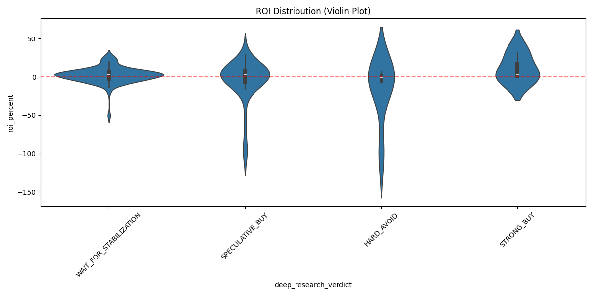

# StockDrop 📉🚀

**StockDrop** Is an autonomous AI hedge fund analyst aimed at solving one specific problem: **Identifying "Buy the Dip" opportunities without the emotional baggage.**

It continuously scans global markets for significant price drops in large-cap companies and deploys a **Council of AI Agents** to debate the fundamental, technical, and macro rationale before issuing a trade recommendation.

---

## 🧠 The "AI Council" Architecture

Unlike simple "screeners" or single-prompt GPT wrappers, StockDrop uses a multi-stage, multi-agent architecture to simulate a real investment committee.

### Phase 1: The Sensors (Data Collection)
Once a stock is identified (dropping >5% in 24h), a team of specialized agents gathers intelligence:
*   **🕵️ News Agent:** Scans thousands of headlines (Benzinga, Reuters, Seeking Alpha) and reads Earnings Transcripts to answer: *Why is the stock down? Is it a structural issue or temporary panic?*
*   **📈 Technical Agent:** Analyzes price action, support levels, RSI, and trend integrity.
*   **🌍 Macro/Economics Agent:** Triggered automatically if the company has high exposure to the US economy, fetching real-time data from the **Federal Reserve (FRED)** (Interest Rates, CPI, GDP) to assess headwinds.
*   **⚔️ Competitive Landscape Agent:** Identifies peers and checks if the drop is company-specific or sector-wide.
*   **📰 Seeking Alpha Agent:** Digs into specialized investor analysis to find contrarian viewpoints.
*   **🧠 Market Sentiment Agent:** Uses Google Search Grounding to gauge the real-time "pulse" of the internet and social sentiment.

### Phase 2: The Debate (Thesis Construction)
Two distinct AI personas review the evidence from Phase 1 independent of each other:
*   **🐂 The Bull (Value Investor):** Constructs the strongest possible argument for **buying**, focusing on overreactions, value discrepancies, and misunderstood catalysts.
*   **🐻 The Bear (Forensic Accountant):** Constructs the strongest argument for **avoiding** the trade, highlighting risks, broken growth stories, and "value traps".

### Phase 3: The Verdict (Portfolio Manager)
*   **⚖️ The Portfolio Manager:** Acting as the final decision-maker, this agent reads both arguments and the raw evidence. It is instructed to be **risk-averse** and verify claims using its own internet search tools. It outputs a final **0-100 Score** and a decision:
    *   `STRONG BUY` / `BUY` / `HOLD` / `SELL` / `STRONG SELL`

---

## 🌍 Global Market Coverage
StockDrop doesn't just watch the S&P 500. It monitors:
*   🇺🇸 **USA** (NYSE, NASDAQ)
*   🇪🇺 **Europe** (STOXX 600 components)
*   🇨🇳 **China** (HKSE, Shanghai - Large Caps)
*   🇮🇳 **India** (Nifty 50 components)

## 🔌 Data Integrations
We fuse reputable financial data with cutting-edge AI:
*   **Markets:** TradingView & Alpaca (Real-time Prices & Screener)
*   **Alternative Data:** DefeatBeta (Transcripts & Niche News)
*   **Economy:** Federal Reserve Economic Data (FRED)
*   **Analysis:** Seeking Alpha & Benzinga Pro
*   **AI Models:** Google Gemini 3.5 Flash (Reasoning Core) & Gemini Deep Research
*   **Search**: Google Search Grounding (Real-time fact-checking)

---

## 🚀 Getting Started

### Prerequisites
*   Python 3.10+
*   Google Cloud API Key (for Gemini)

### Installation

1.  **Clone the repository:**
    ```bash
    git clone https://github.com/your-repo/Stock-Tracker.git
    cd Stock-Tracker
    ```

2.  **Set up Virtual Environment:**
    ```bash
    python3 -m venv venv
    source venv/bin/activate
    ```

3.  **Install Dependencies:**
    ```bash
    pip install -r requirements.txt
    ```

4.  **Configuration (.env):**
    Create a `.env` file and add your keys:
    ```env
    GEMINI_API_KEY=your_key_here
    ALPACA_API_KEY=optional
    ALPACA_SECRET_KEY=optional
    ```

### Running the App
Start the autonomous loop (scans every 2 hours):
```bash
python main.py
```
Or run the web dashboard to view reports:
```bash
uvicorn main:app --reload
```
View the dashboard at `http://localhost:8000`.

---

## 📊 Performance Analysis

We analyze the performance of the AI Council's `deep_research_verdict` by comparing the price at recommendation vs. the price 1 week later.

### ROI Distribution by Verdict


### Summary Statistics (ROI %)

| Verdict | Count | Mean | Median | Min | Max |
| :--- | :---: | :---: | :---: | :---: | :---: |
| **HARD_AVOID** | 6 | -15.08% | -3.24% | -99.84% | 19.65% |
| **SPECULATIVE_BUY** | 34 | 3.53% | 6.45% | -99.36% | 68.01% |
| **STRONG_BUY** | 3 | 6.29% | -1.69% | -8.94% | 29.49% |
| **WAIT_FOR_STABILIZATION** | 96 | 3.79% | 1.56% | -39.93% | 65.61% |

---

## ⚠️ Disclaimer
**THIS SOFTWARE IS FOR EDUCATIONAL AND RESEARCH PURPOSES ONLY.**
It is NOT financial advice. The "decisions" made by the AI agents are simulations. Trading stocks involves significant risk of capital loss. Do not trade based on these outputs.
