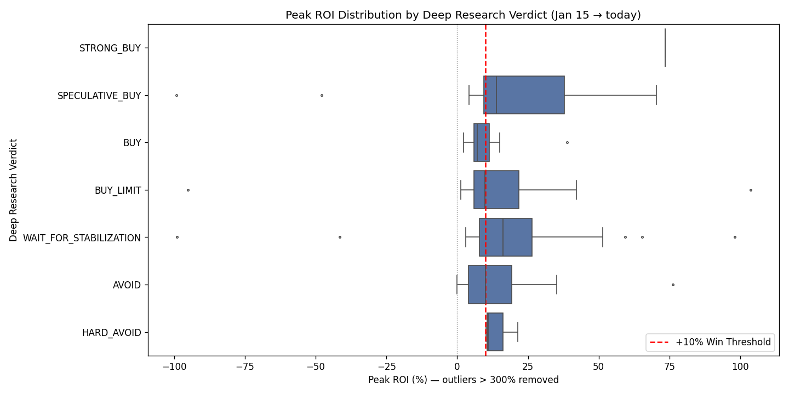
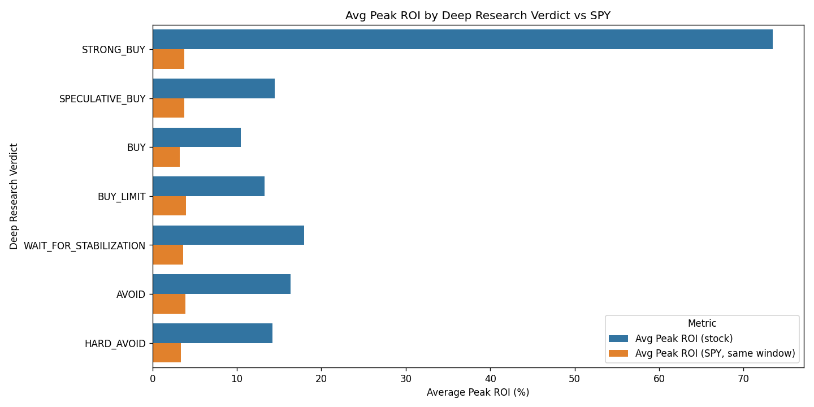

# StockDrop 📉🚀

**StockDrop** is an autonomous AI hedge fund analyst aimed at solving one specific problem: **Identifying "Buy the Dip" opportunities without the emotional baggage.**

It continuously scans global markets for significant price drops in large-cap companies and deploys a **Council of AI Agents** to debate the fundamental, technical, and macro rationale before issuing a trade recommendation. It runs as a FastAPI service with a live dashboard, background workers, and a SQLite store that tracks every decision through to outcome.

---

## 🧠 The "AI Council" Architecture

Unlike simple "screeners" or single-prompt GPT wrappers, StockDrop uses a multi-stage, multi-agent architecture to simulate a real investment committee.

### Phase 0: The Gatekeeper (Pre-filter)
Before spending tokens on a full analysis, every candidate must clear two cheap, deterministic checks:
*   **📉 Bollinger %B < 0.50** — the stock has actually broken into the lower half of its recent volatility band, not just had a noisy red day.
*   **🌐 Market Regime Check** — SPY vs. its 200-day SMA. In a confirmed downtrend the bar is raised; falling-knife environments get filtered out before the council convenes.

### Phase 1: The Sensors (Data Collection)
Once a stock clears the gate (dropping >5% in 24h, %B in dip territory), a team of specialized agents gathers intelligence in parallel:
*   **🕵️ News Agent:** Scans headlines (Benzinga, Seeking Alpha) and reads earnings transcripts to answer: *Why is the stock down? Is it structural or temporary panic?*
*   **📈 Technical Agent:** Analyzes price action, support levels, RSI, and trend integrity using TradingView data.
*   **🌍 Macro/Economics Agent:** Triggered automatically when the company has high US-economy exposure, fetching real-time data from the **Federal Reserve (FRED)** (rates, CPI, GDP) to assess headwinds.
*   **⚔️ Competitive Landscape Agent:** Identifies peers and checks whether the drop is company-specific or sector-wide.
*   **📰 Seeking Alpha Agent:** Digs into specialized investor analysis to find contrarian viewpoints.
*   **🧠 Market Sentiment Agent:** Uses Google Search Grounding to gauge the real-time "pulse" of the internet and social sentiment.

### Phase 2: The Debate (Thesis Construction)
Three distinct AI personas review the Phase 1 evidence independently:
*   **🐂 The Bull (Value Investor):** Strongest argument for **buying** — overreactions, value discrepancies, misunderstood catalysts.
*   **🐻 The Bear (Forensic Accountant):** Strongest argument for **avoiding** — broken growth stories, value traps, hidden risks.
*   **🛡️ The Risk Manager:** Independently assesses downside scenarios, position-sizing implications, and falling-knife indicators.

### Phase 3: The Verdict (Portfolio Manager)
*   **⚖️ The Portfolio Manager (PM):** Reads all three Phase 2 arguments plus the raw Phase 1 evidence. It is instructed to be **risk-averse** and verifies claims using its own internet search tools. It outputs a **0–100 score** plus one of four actions:
    *   `BUY` — enter at market.
    *   `BUY_LIMIT` — wait for a specific entry price; price needs to stabilize or dip slightly more.
    *   `WATCH` — thesis isn't ready; monitor.
    *   `AVOID` — pass.

### Phase 4: The Deep Research Validator (Senior Reviewer)
Because true Deep Research is extremely token-heavy and time-consuming, the system does not deep-research every dropping stock. It acts as a senior reviewer with override authority.

*   **The Filter:** Only candidates the PM rates `BUY`, `BUY_LIMIT`, or `STRONG_BUY` are forwarded to the **Gemini Deep Research Agent**, which runs on its own worker thread with dual priority queues (individual reviews high-priority, batch jobs low-priority) and a hard 60-second rate limit between requests.
*   **The Final Verification:** The Deep Research agent independently scours the internet, reads sprawling financial documents, and issues an ultimate **DR Verdict** that can validate or overrule the PM:
    *   `STRONG_BUY` / `SPECULATIVE_BUY`: Trade is deeply validated.
    *   `BUY` / `BUY_LIMIT`: Confirmed at market or with an entry limit.
    *   `WAIT_FOR_STABILIZATION`: Fundamentals look good, but a falling-knife pattern is detected — wait.
    *   `AVOID` / `HARD_AVOID`: DR overrules the council, identifying a value trap or fundamental flaw.

---

## 🌍 Global Market Coverage
StockDrop doesn't just watch the S&P 500. It monitors:
*   🇺🇸 **USA** (NYSE, NASDAQ)
*   🇪🇺 **Europe** (STOXX 600 components)
*   🇨🇳 **China** (HKSE, Shanghai – Large Caps)
*   🇮🇳 **India** (Nifty 50 components)

## 🔌 Data Integrations
*   **Markets:** TradingView, Alpaca, Polygon, Finnhub, Alpha Vantage, yfinance
*   **News & Analysis:** Benzinga Pro, Seeking Alpha (via RapidAPI)
*   **Economy:** Federal Reserve Economic Data (FRED)
*   **AI Models:** Google Gemini (`gemini-3.1-pro-preview` for PM and Deep Research, `gemini-3-flash-preview` for fast sensor calls)
*   **Search:** Google Search Grounding (real-time fact-checking)
*   **Storage & Delivery:** SQLite for decision history, Google Cloud Storage for snapshots, daily email summaries to subscribers

---

## 🏗️ How It Runs

StockDrop is a **FastAPI web service**. On startup it spins up several background workers:

*   **Periodic scanner** — every 20 minutes, scans for >5% drops and pushes survivors through the council.
*   **Deep Research worker** — daemon thread with dual priority queues, 60s rate-limited.
*   **GCS uploader** — periodic snapshots of decisions and reports.
*   **Email summary generator** — daily digest to subscribers.
*   **Performance & trade-report jobs** — track every decision's outcome and emit CSVs hourly.

The HTML dashboard surfaces live recommendations, decision history, and performance metrics. REST endpoints power both the dashboard and external integrations.

---

## 🚀 Getting Started

### Prerequisites
*   **Python 3.9.6** (pinned in `runtime.txt`)
*   API keys for Gemini and the data providers below
*   Google Cloud credentials (for GCS uploads — optional in dev)

### Installation

```bash
git clone https://github.com/simjbaumgart/stockdrop.git
cd stockdrop
python3 -m venv venv
source venv/bin/activate
pip install -r requirements.txt
```

### Configure `.env`
```env
GEMINI_API_KEY=your_key_here
ALPACA_API_KEY=your_key_here
ALPACA_SECRET_KEY=your_key_here
ALPHA_VANTAGE_API_KEY=your_key_here
BENZINGA_API_KEY=your_key_here
FINNHUB_API_KEY=your_key_here
POLYGON_API_KEY=your_key_here
RAPIDAPI_KEY_SEEKING_ALPHA=your_key_here
FRED_API_KEY=your_key_here
# Plus Google Cloud credentials for GCS uploads
```

### Running the App

**Development:**
```bash
uvicorn main:app --reload
```

**Production (`Procfile`):**
```bash
uvicorn main:app --host 0.0.0.0 --port $PORT
```

Dashboard: `http://localhost:8000`. Background workers (scanner, Deep Research, uploads, email) start automatically with the app.

### Other Entry Points
*   `./run_deep_research.sh [--date 2026-02-07] [--dry-run] [--limit 3]` — backfill Deep Research for past decisions.
*   `scripts/reassess_positions.py` — **Sell Council**: re-runs sensors and Deep Research with sell-focused prompts for owned positions.
*   `scripts/analysis/dr_verdict_readout.py` — recompute the DR verdict performance table from live prices.
*   `scripts/` — 20+ utilities for analysis, automation, and ops.

---

## 📊 Performance: Deep Research Verdicts vs Reality

Because Deep Research is the system's senior reviewer — the only stage with override authority over the PM — its verdicts are the most useful unit to evaluate. The table below covers **every decision since Jan 15, 2026 that received a DR verdict**, scored against live prices through today.

**Methodology:** combined dataset from `data/subscribers.db` and `subscribers.db`, joined to live yfinance history. Outliers with |peak ROI| > 300% (corporate-action artifacts) are excluded from cohort aggregates. SPY peak ROI is computed over the *exact same window* per ticker, so the comparison is apples-to-apples.

### Headline numbers
*   **Trades analyzed: 155** (decisions with a Deep Research verdict)
*   **Overall win rate (>10% peak): 57.4%**
*   **Avg peak ROI across all DR-verdicted trades: 15.45%**
*   **SPY avg peak ROI over the same windows: 3.76%** (~4x baseline)

### Performance by DR Verdict

| DR Verdict | N | Avg Date | Avg Peak ROI | Median Peak ROI | SPY (same window) | Win Rate (>10%) | Loss Rate (current ≤ -10%) |
|---|---|---|---|---|---|---|---|
| **STRONG_BUY** | 1 | Feb 03 | **73.46%** | 73.46% | 3.77% | **100.0%** | 0.0% |
| **SPECULATIVE_BUY** | 20 | Jan 30 | **14.48%** | 13.90% | 3.76% | **70.0%** | 30.0% |
| **BUY_LIMIT** | 55 | Mar 05 | **13.25%** | 9.86% | 3.95% | 49.1% | 18.2% |
| **BUY** | 11 | Mar 19 | **10.44%** | 7.04% | 3.21% | 27.3% | 18.2% |
| **WAIT_FOR_STABILIZATION** | 51 | Jan 29 | **17.97%** | 16.16% | 3.67% | 66.7% | 45.1% |
| **AVOID** | 14 | Apr 02 | **16.37%** | 10.06% | 3.92% | 50.0% | 0.0% |
| **HARD_AVOID** | 3 | Jan 28 | **14.22%** | 10.90% | 3.37% | 100.0% | 66.7% |

### What this tells us

*   **The high-conviction signal is real.** `SPECULATIVE_BUY` (N=20) hits a 70% win rate at ~4x SPY's peak ROI over the same windows. This is the cohort the system is designed to surface, and it pays.
*   **`WAIT_FOR_STABILIZATION` is a useful stop-sign — peak ROI is a misleading metric here.** These names *do* run (17.97% avg peak), but the 45% loss rate at current price shows what the verdict is actually flagging: stocks that bounce, then keep bleeding. The DR agent is correctly identifying falling knives that have a relief rally in them but no durable thesis. **Acting on peak ROI alone here would be a trap** — the verdict is telling you to wait for confirmation, and the data backs that up.
*   **Even `AVOID` candidates often bounce.** Most >5% drops in large-caps see *some* relief rally, regardless of fundamentals. `AVOID` averages 16% peak ROI but a 0% loss rate at current — meaning these stocks rarely collapse further, they just don't sustain. Disciplined entry/exit is what separates the alpha from the noise; that's the empirical motivation for the LOO and Sell Council workstreams below.
*   **`HARD_AVOID` (N=3) is too small to draw conclusions** — a 67% loss-rate-at-current is consistent with the verdict's intent (true value traps), but we need more samples.

### Visuals


*Box plot of peak ROI per DR verdict. Outliers > 300% removed.*


*Side-by-side comparison: each cohort's avg peak ROI against SPY's peak ROI over the same windows.*

---

## 🔭 Active Workstreams
Documented in `docs/proposals/`:
*   **LOO (Limit Order Optimizer)** — capture the alpha currently lost when limit orders don't trigger.
*   **Technical Dual-Track** — deterministic risk flags from raw TradingView data alongside LLM analysis.
*   **Sell Council (Plan A)** — sensor + Deep Research re-runs with sell-focused prompts for owned positions.
*   **Sell Price Extension (Plan B)** — emit `sell_price_low/high/ceiling_exit/exit_trigger` at initial analysis time.
*   **Tiered Bollinger Gate** — replace flat %B < 0.50 with graduated tiers.

---

## ⚠️ Disclaimer
**THIS SOFTWARE IS FOR EDUCATIONAL AND RESEARCH PURPOSES ONLY.**
It is NOT financial advice. The "decisions" made by the AI agents are simulations. Trading stocks involves significant risk of capital loss. Do not trade based on these outputs.
