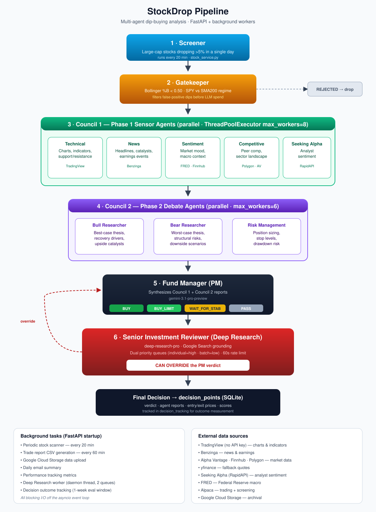
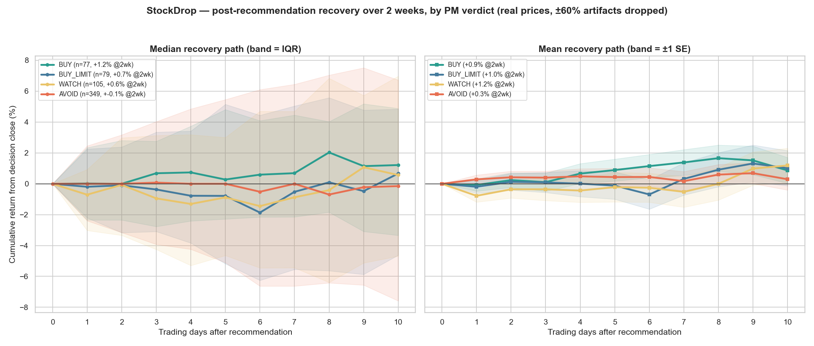
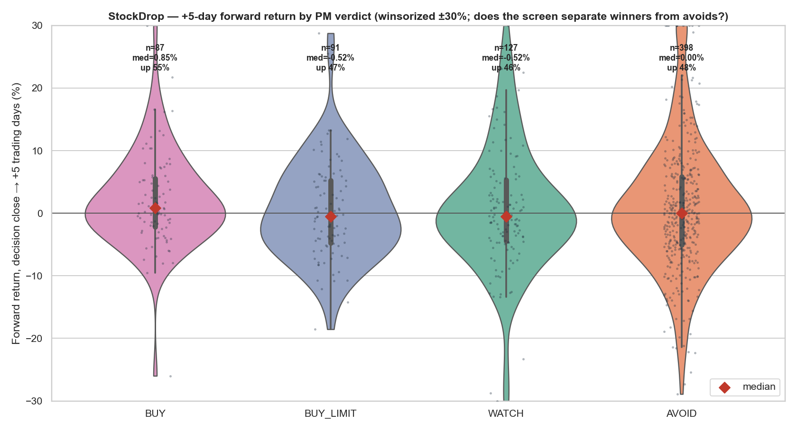
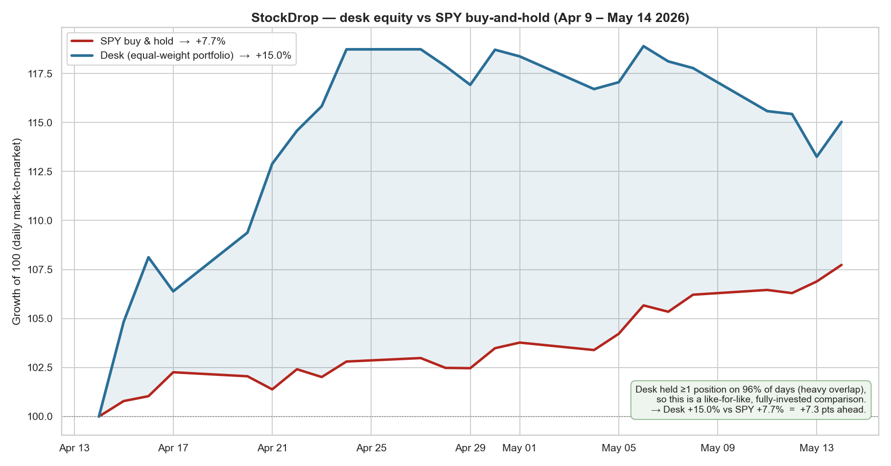
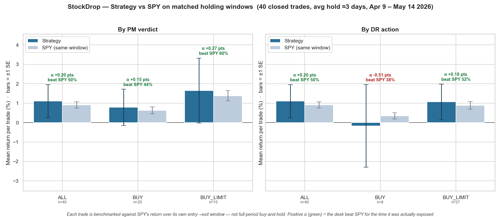
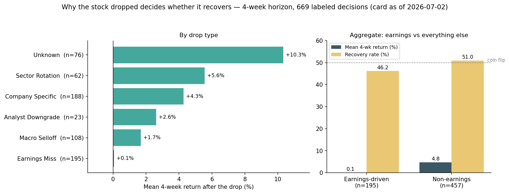

# StockDrop 📉🚀

**StockDrop** is an autonomous AI hedge fund analyst aimed at solving one specific problem: **Identifying "Buy the Dip" opportunities without the emotional baggage.**

It continuously scans global markets for significant price drops in large-cap companies and deploys a **Council of AI Agents** to debate the fundamental, technical, and macro rationale before issuing a trade recommendation. It runs as a FastAPI service with a live dashboard, background workers, and a SQLite store that tracks every decision through to outcome.

---

## 🧠 The "AI Council" Architecture

Unlike simple "screeners" or single-prompt GPT wrappers, StockDrop uses a multi-stage, multi-agent architecture to simulate a real investment committee.



### Phase 0: The Gatekeeper (Pre-filter)
Before spending tokens on a full analysis, every candidate must clear two cheap, deterministic checks:
*   **📉 Bollinger %B < 0.50** — the stock has actually broken into the lower half of its recent volatility band, not just had a noisy red day.
*   **🌐 Market Regime Check** — SPY vs. its 200-day SMA. In a confirmed downtrend the bar is raised; falling-knife environments get filtered out before the council convenes.

### Phase 1: The Sensors (Data Collection)
Once a stock clears the gate (dropping >5% in 24h, %B in dip territory), a team of specialized agents gathers intelligence in parallel:
*   **🕵️ News Agent:** Scans headlines (Benzinga, Seeking Alpha) and reads earnings transcripts to answer: *Why is the stock down? Is it structural or temporary panic?*
*   **📈 Technical Agent:** Analyzes price action, support levels, RSI, and trend integrity using TradingView data.
*   **🌍 Macro/Economics Agent:** Triggered automatically when the company has high US-economy exposure, fetching real-time data from the **Federal Reserve (FRED)** (rates, CPI, GDP) to assess headwinds.
*   **⚔️ Competitive Landscape Agent:** Identifies peers and checks whether the drop is company-specific or sector-wide.
*   **📰 Seeking Alpha Agent:** Digs into specialized investor analysis to find contrarian viewpoints.
*   **🧠 Market Sentiment Agent:** Uses Google Search Grounding to gauge the real-time "pulse" of the internet and social sentiment.

### Phase 2: The Debate (Thesis Construction)
Three distinct AI personas review the Phase 1 evidence independently:
*   **🐂 The Bull (Value Investor):** Strongest argument for **buying** — overreactions, value discrepancies, misunderstood catalysts.
*   **🐻 The Bear (Forensic Accountant):** Strongest argument for **avoiding** — broken growth stories, value traps, hidden risks.
*   **🛡️ The Risk Manager:** Independently assesses downside scenarios, position-sizing implications, and falling-knife indicators.

### Phase 3: The Verdict (Portfolio Manager)
*   **⚖️ The Portfolio Manager (PM):** Reads all three Phase 2 arguments plus the raw Phase 1 evidence. It is instructed to be **risk-averse** and verifies claims using its own internet search tools. It outputs a **0–100 score** plus one of four actions:
    *   `BUY` — enter at market.
    *   `BUY_LIMIT` — wait for a specific entry price; price needs to stabilize or dip slightly more.
    *   `WATCH` — thesis isn't ready; monitor.
    *   `AVOID` — pass.

### Phase 3.5: The Decision Gates (Deterministic Guardrails)
The PM's verdict doesn't go straight to the book. A set of **hard, code-level gates** (`app/services/decision_gate_service.py`) runs after the PM and before persistence — rules earned from monthly outcome audits, not vibes:
*   **Drop-Type Gate:** buys on `EARNINGS_MISS` / `COMPANY_SPECIFIC` / `ANALYST_DOWNGRADE` drops have no historical edge (confirmed in three separate audits) — downgraded to `WATCH`.
*   **SA Quant / News Sentiment / Unconfirmed-Drop Gates:** weak quant rating, bearish sentiment without a named catalyst, or a drop the News agent couldn't confirm all demote a buy.
*   **The NAMED_EVENT escape hatch:** Deep Research can lift a gated `WATCH` back to `BUY_LIMIT` — but only by citing a specific, dated, verifiable catalyst through a structured field. This single rule added **+39.7 pts in June**.
*   **Degeneracy monitors:** every agent signal feeding a gate carries a trailing firing-rate monitor. If a signal mode-collapses (the falling-knife verdict once hit 97% "YES"), the gate auto-suspends rather than firing on noise.

The PM's original action is preserved (`pre_gate_action`), so gated-vs-kept performance is a free, ongoing A/B test.

### Phase 4: The Deep Research Validator (Senior Reviewer)
Because true Deep Research is extremely token-heavy and time-consuming, the system does not deep-research every dropping stock. It acts as a senior reviewer with override authority.

*   **The Filter:** Only candidates the PM rates `BUY`, `BUY_LIMIT`, or `STRONG_BUY` are forwarded to the **Gemini Deep Research Agent**, which runs on its own worker thread with dual priority queues (individual reviews high-priority, batch jobs low-priority) and a hard 60-second rate limit between requests.
*   **The Final Verification:** The Deep Research agent independently scours the internet, reads sprawling financial documents, and issues an ultimate **DR Verdict** that can validate or overrule the PM:
    *   `STRONG_BUY` / `SPECULATIVE_BUY`: Trade is deeply validated.
    *   `BUY` / `BUY_LIMIT`: Confirmed at market or with an entry limit.
    *   `WAIT_FOR_STABILIZATION`: Fundamentals look good, but a falling-knife pattern is detected — wait.
    *   `AVOID` / `HARD_AVOID`: DR overrules the council, identifying a value trap or fundamental flaw.

### The Feedback Loop: Three-Tier Learning Architecture
StockDrop learns from its own track record — carefully. Every decision is outcome-labeled at fixed horizons (1/2/4 weeks) in a `decision_outcomes` table, and findings feed back through exactly one of three tiers (`docs/proposals/THREE_TIER_FEEDBACK_PROPOSAL.md`):

1.  **Code gates** (invisible to agents) — findings confirmed in ≥3 audits become deterministic rules.
2.  **Pinned base rates** (visible, advisory) — a hand-pinned calibration card injected into PM/DR prompts as *data only*, updated exclusively by a monthly audit + pin script, with a 45-day staleness refusal.
3.  **Console-only monitoring** — everything regime-dependent or small-n stays on dashboards, never in prompts.

The explicit anti-goal: no "you were often wrong about X" narratives in any prompt — agents fed mistake-signals overcorrect into mode collapse rather than calibrate. A monthly audit runbook (`docs/audits/MONTHLY_AUDIT_RUNBOOK.md`) re-earns every gate and every prompt line; the evidence behind each lives in `docs/audits/FINDINGS_LEDGER.md`.

---

## 🌍 Market Coverage
StockDrop currently scans the **S&P 500** (NYSE, NASDAQ) via TradingView's `america` screener. The codebase is structured to add other indices (STOXX 600, CSI 300, Nifty 50) — each just needs an entry in `indices_config` — but only the S&P 500 is enabled today.

## 🔌 Data Integrations
*   **Markets:** TradingView, Alpaca, Polygon, Finnhub, Alpha Vantage, yfinance
*   **News & Analysis:** Benzinga Pro, Seeking Alpha (via RapidAPI)
*   **Economy:** Federal Reserve Economic Data (FRED)
*   **AI Models:** Google Gemini (`gemini-3.1-pro-preview` for PM and Deep Research, `gemini-3-flash-preview` for fast sensor calls)
*   **Search:** Google Search Grounding (real-time fact-checking)
*   **Storage & Delivery:** SQLite for decision history, Google Cloud Storage for snapshots, daily email summaries to subscribers

---

## 🏗️ How It Runs

StockDrop is a **FastAPI web service**. On startup it spins up several background workers:

*   **Periodic scanner** — every 20 minutes, scans for >5% drops and pushes survivors through the council.
*   **Deep Research worker** — daemon thread with dual priority queues, 60s rate-limited.
*   **GCS uploader** — periodic snapshots of decisions and reports.
*   **Email summary generator** — daily digest to subscribers.
*   **Performance & trade-report jobs** — track every decision's outcome and emit CSVs hourly.
*   **Nightly outcome marking** — labels every decision's forward return in `decision_outcomes`, runs the gate degeneracy check, and QCs calibration-card freshness.

The HTML dashboard surfaces live recommendations, decision history, and performance metrics. REST endpoints power both the dashboard and external integrations; `/health` reports outcome-pipe freshness and shadow-A/B progress.

---

## 🚀 Getting Started

### Prerequisites
*   **Python 3.9.6** (pinned in `runtime.txt`)
*   API keys for Gemini and the data providers below
*   Google Cloud credentials (for GCS uploads — optional in dev)

### Installation

```bash
git clone https://github.com/simjbaumgart/stockdrop.git
cd stockdrop
python3 -m venv venv
source venv/bin/activate
pip install -r requirements.txt
```

### Configure `.env`
```env
GEMINI_API_KEY=your_key_here
ALPACA_API_KEY=your_key_here
ALPACA_SECRET_KEY=your_key_here
ALPHA_VANTAGE_API_KEY=your_key_here
BENZINGA_API_KEY=your_key_here
FINNHUB_API_KEY=your_key_here
POLYGON_API_KEY=your_key_here
RAPIDAPI_KEY_SEEKING_ALPHA=your_key_here
FRED_API_KEY=your_key_here
# Plus Google Cloud credentials for GCS uploads

# Feature flags (defaults shown)
CALIBRATION_ENABLED=0     # inject pinned base-rate card into PM/DR prompts
CALIBRATION_SHADOW=1      # Stage-1 shadow A/B (logs calibrated verdicts without acting)
```

### Running the App

**Development:**
```bash
uvicorn main:app --reload
```

**Production (`Procfile`):**
```bash
uvicorn main:app --host 0.0.0.0 --port $PORT
```

Dashboard: `http://localhost:8000`. Background workers (scanner, Deep Research, uploads, email) start automatically with the app.

### Other Entry Points
*   `./run_deep_research.sh [--date 2026-02-07] [--dry-run] [--limit 3]` — backfill Deep Research for past decisions.
*   `scripts/reassess_positions.py` — **Sell Council**: re-runs sensors and Deep Research with sell-focused prompts for owned positions.
*   `scripts/analysis/dr_verdict_readout.py` — recompute the DR verdict performance table from live prices.
*   `scripts/` — 20+ utilities for analysis, automation, and ops.

---

## 📈 3-Month Readout: Forward Returns & Recovery by Verdict (Apr–Jun 2026)

Does the verdict ladder actually predict which dips recover? Every PM decision since Apr 9, 2026 is anchored at its **decision-day close** and tracked against live yfinance prices (artifacts > ±30–60% dropped, **medians** used). Scripts: `scripts/analysis/recovery_curves.py`, `verdict_forward_returns.py`.

### Recovery over the two weeks after the recommendation

Median cumulative return from the decision-day close, by trading day:

| Verdict | n | +3d | +6d | +8d | **+2wk (d10)** |
|---|---|---|---|---|---|
| **BUY** | 77 | +0.68% | +0.59% | +2.03% | **+1.21%** |
| **BUY_LIMIT** | 79 | −0.37% | −1.86% | +0.10% | **+0.67%** |
| **WATCH** | 105 | −0.94% | −1.45% | −0.41% | **+0.57%** |
| **AVOID** | 349 | +0.08% | −0.52% | −0.70% | **−0.15%** |


*Median (left, IQR band) and mean (right, ±1 SE band) cumulative return over the 10 trading days after each recommendation.*

### Forward return at +5 days, by verdict


*Distribution of the one-week forward return per verdict (winsorized ±30%). Only the top `BUY` bucket sits clearly above zero.*

### Desk equity vs SPY


*Daily mark-to-market equity (equal-weight across concurrent open positions) vs SPY buy-and-hold over the trading window. Because trades overlap heavily, the desk held ≥1 position on **96% of days** — so this is a like-for-like, fully-invested comparison. The desk ends **+15.0% vs SPY +7.7% (+7.3 pts ahead)**.*

### Realized P&L vs SPY — matched holding windows


*Per-trade view: each closed trade is benchmarked against SPY's return over its **own entry→exit window** (avg hold ≈3 days) — not full-period buy-and-hold. The desk posts positive alpha in aggregate (+0.20 pts) and in both PM buckets (`BUY_LIMIT` +0.27); only the small DR-`BUY` group (n=8) lags SPY.*

### The single strongest pattern: earnings drops don't recover, other drops do

The most durable finding across three monthly audits (Apr, May, Jun) splits the universe by *why* the stock dropped (pinned calibration card as of 2026-07-02, 669 labeled decisions, 4-week horizon):

| Drop cohort | n | Mean 4-wk return | Recovery rate |
|---|---|---|---|
| **Earnings-driven** (miss/guidance cut) | 195 | **+0.1%** | 46% |
| **Non-earnings** (macro, sector, narrative) | 457 | **+4.8%** | 51% |


*Left: mean 4-week return by drop type — earnings misses (red) are the only cohort with essentially zero recovery. Right: the aggregate split. Generated from `data/calibration_card_pinned.json` (single source).*

A -5% dip caused by an earnings miss is usually a legitimate repricing — the market got new fundamental information and buying it carries no edge (audit slices: −1.5 to −3.6 pts alpha vs SPY). The same-size dip on a sector selloff or narrative scare is where the dip-buying thesis actually works (+5.3 pts alpha @28d, 69% win in the latest audit). This finding is enforced in code as the Drop-Type Gate, with the NAMED_EVENT catalyst as the only way past it.

### What this tells us

*   **The ladder is correctly ordered over two weeks:** `BUY` (+1.21%) > `BUY_LIMIT` (+0.67%) ≈ `WATCH` (+0.57%) > `AVOID` (−0.15%). `BUY` is the only bucket that recovers monotonically — the cohort actually catching the bounce.
*   **`BUY_LIMIT`/`WATCH` keep falling ~1.5 weeks, then stabilize** (troughing near −1.9% around day 6). Empirical validation of the limit-order discipline: those dips fall further before turning, so a limit entry *below* the decision price beats a market buy.
*   **`AVOID` picks non-recoverers, not losers** — flat-to-negative all fortnight (−0.15% while SPY rose), without collapsing outright.
*   **The desk beats the market over the traded window.** As a fully-invested equal-weight portfolio it returned +15.0% vs SPY's +7.7% (Apr 9 – May 14); on a stricter per-trade matched-window basis the edge is a thinner but still-positive +0.2 pts (40 closed trades, 55% win).

---

## 🔭 Active Workstreams
Documented in `docs/proposals/` and `docs/audits/`:
*   **Monthly audit loop** — `MONTHLY_AUDIT_RUNBOOK.md` + `FINDINGS_LEDGER.md`: every gate and prompt line gets re-earned monthly (next audit ~Aug 1).
*   **Calibration shadow A/B (Stage 1, live)** — measuring whether pinned base rates in the PM/DR prompts actually improve verdicts before enabling them.
*   **LOO (Limit Order Optimizer)** — capture the alpha currently lost when limit orders don't trigger.
*   **Technical Dual-Track** — deterministic risk flags from raw TradingView data alongside LLM analysis.
*   **Sell Council** — sensor + Deep Research re-runs with sell-focused prompts; buys carry a default 4-week reassess cadence (`--due` filter).
*   **Tiered Bollinger Gate** — replace flat %B < 0.50 with graduated tiers.

---

## ⚠️ Disclaimer
**THIS SOFTWARE IS FOR EDUCATIONAL AND RESEARCH PURPOSES ONLY.**
It is NOT financial advice. The "decisions" made by the AI agents are simulations. Trading stocks involves significant risk of capital loss. Do not trade based on these outputs.
