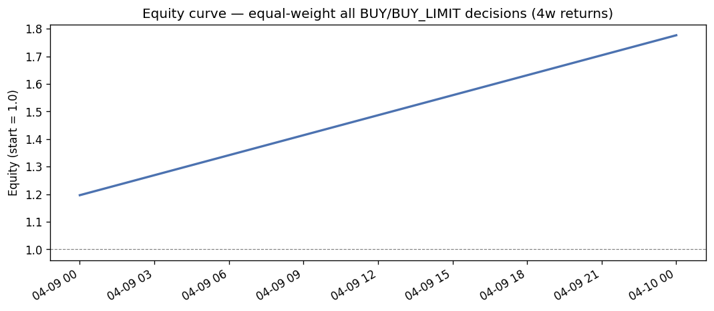
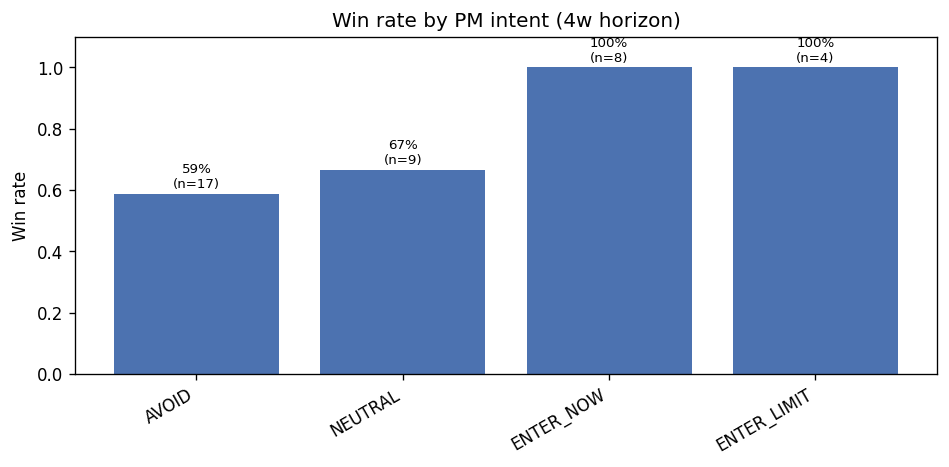
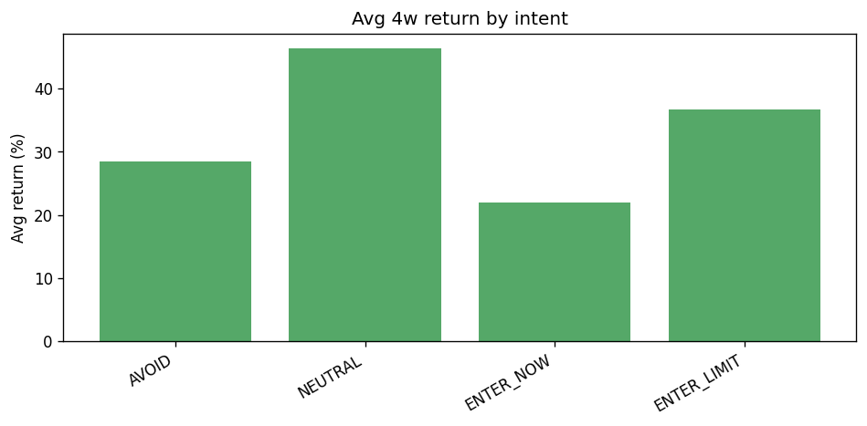
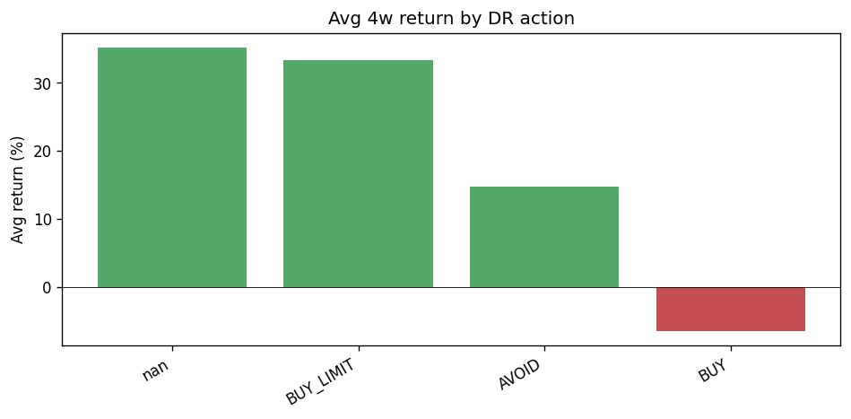
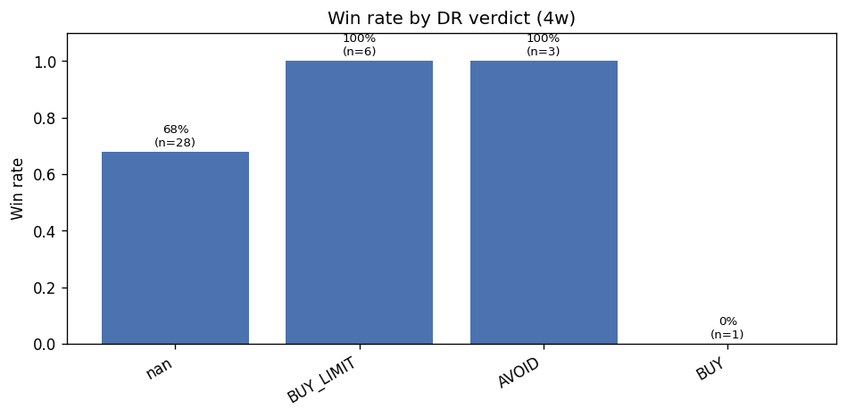
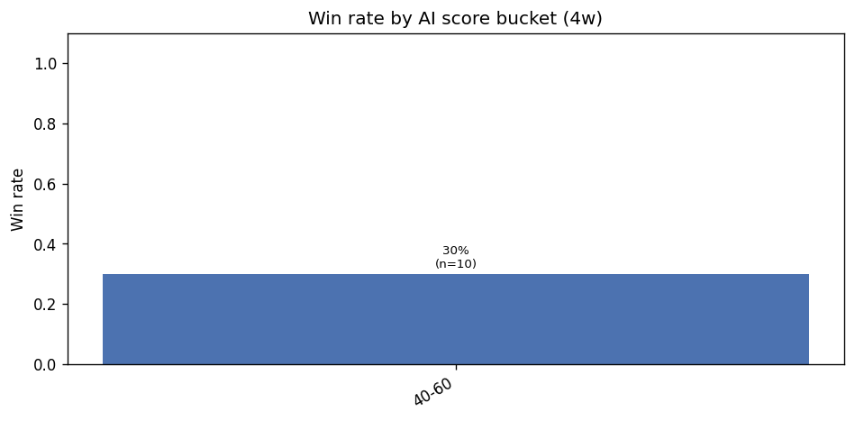
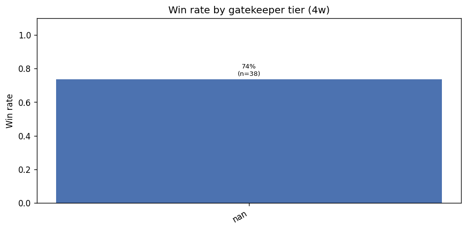
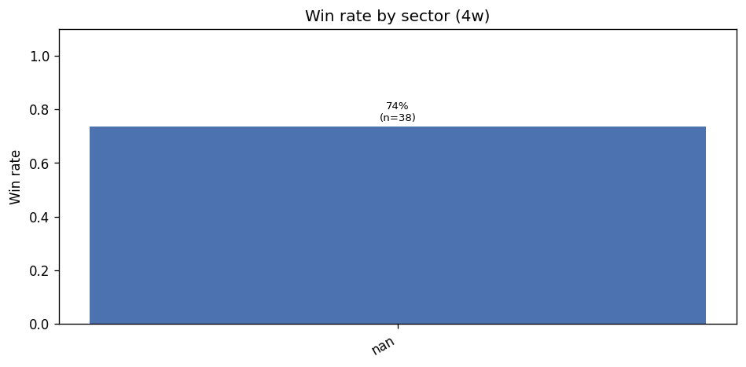
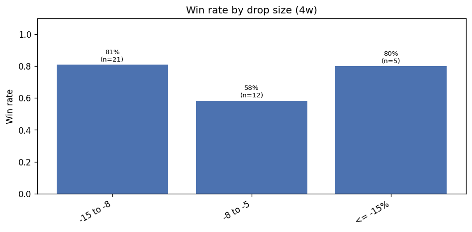
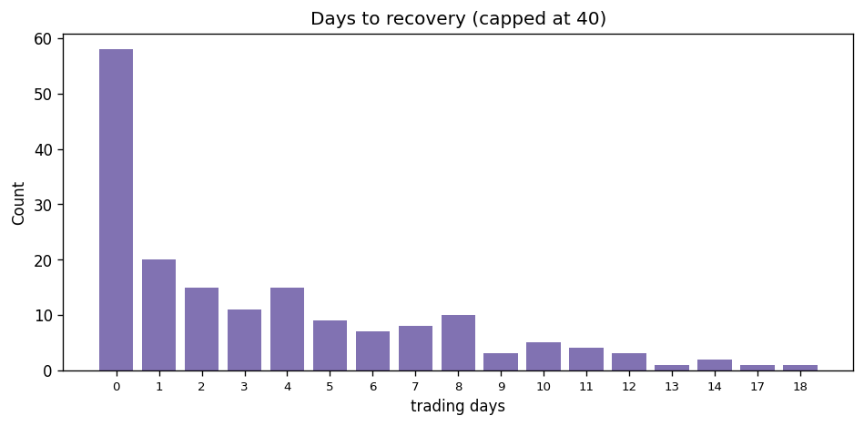

# StockDrop Performance Deep-Dive — cohort >= 2026-02-01

_Generated 2026-05-08 21:52. Cohort size: 363 decisions._

## Contents

1. [Headline equity curve](#headline-equity-curve)
2. [Q1 — Verdict accuracy](#q1--verdict-accuracy)
3. [Q2 — Deep Research override value](#q2--deep-research-override-value)
4. [Q3 — Per-agent signal strength](#q3--per-agent-signal-strength)
5. [Q4 — Gatekeeper calibration](#q4--gatekeeper-calibration)
6. [Q5 — Regime / sector conditioning](#q5--regime---sector-conditioning)
7. [Q6 — BUY_LIMIT execution](#q6--buy_limit-execution)
8. [Q7 — Drop-size sweet spot](#q7--drop-size-sweet-spot)
9. [Q8 — Time-to-recovery distribution](#q8--time-to-recovery-distribution)

## Headline equity curve

_Equal-weight cumulative growth assuming each ENTER_NOW/ENTER_LIMIT decision is held for 4 weeks._

## Q1 — Verdict accuracy

**Verdict win-rate at 4 weeks:**

| intent      |   count |   win_rate |   avg_return |   median_return |   std_return |
|:------------|--------:|-----------:|-------------:|----------------:|-------------:|
| AVOID       |      17 |      0.588 |        0.285 |           0.08  |        0.748 |
| NEUTRAL     |       9 |      0.667 |        0.464 |           0.021 |        1.059 |
| ENTER_NOW   |       8 |      1     |        0.219 |           0.18  |        0.172 |
| ENTER_LIMIT |       4 |      1     |        0.368 |           0.142 |        0.531 |

**At each horizon (1w / 2w / 4w / 8w):**

| horizon   | intent      |   n |   win_rate |   avg_return |
|:----------|:------------|----:|-----------:|-------------:|
| 1w        | AVOID       | 156 |      0.532 |        0.038 |
| 1w        | NEUTRAL     |  56 |      0.518 |        0.012 |
| 1w        | ENTER_NOW   |  33 |      0.576 |        0.126 |
| 1w        | ENTER_LIMIT |  27 |      0.556 |        0.018 |
| 2w        | AVOID       | 115 |      0.504 |        0.063 |
| 2w        | NEUTRAL     |  36 |      0.694 |        0.124 |
| 2w        | ENTER_NOW   |  17 |      0.765 |        0.23  |
| 2w        | ENTER_LIMIT |  16 |      0.5   |        0.034 |
| 4w        | AVOID       |  17 |      0.588 |        0.285 |
| 4w        | NEUTRAL     |   9 |      0.667 |        0.464 |
| 4w        | ENTER_NOW   |   8 |      1     |        0.219 |
| 4w        | ENTER_LIMIT |   4 |      1     |        0.368 |

## Q2 — Deep Research override value

**Outcome by Deep Research action:**

| deep_research_action   |   count |   win_rate |   avg_return |   median_return | std_return   |
|:-----------------------|--------:|-----------:|-------------:|----------------:|:-------------|
|                        |      28 |      0.679 |        0.352 |           0.052 | 0.820        |
| BUY_LIMIT              |       6 |      1     |        0.333 |           0.173 | 0.417        |
| AVOID                  |       3 |      1     |        0.148 |           0.148 | 0.063        |
| BUY                    |       1 |      0     |       -0.065 |          -0.065 |              |

## Q3 — Per-agent signal strength

**By DR verdict:**

| deep_research_verdict   |   count |   win_rate |   avg_return |   median_return | std_return   |
|:------------------------|--------:|-----------:|-------------:|----------------:|:-------------|
|                         |      28 |      0.679 |        0.352 |           0.052 | 0.820        |
| BUY_LIMIT               |       6 |      1     |        0.333 |           0.173 | 0.417        |
| AVOID                   |       3 |      1     |        0.148 |           0.148 | 0.063        |
| BUY                     |       1 |      0     |       -0.065 |          -0.065 |              |

**By AI score bucket:**

| bucket   |   count | win_rate   | avg_return   | median_return   | std_return   |
|:---------|--------:|:-----------|:-------------|:----------------|:-------------|
| 40-60    |      10 | 0.300      | -0.031       | -0.047          | 0.039        |
| <40      |       0 |            |              |                 |              |
| 60-80    |       0 |            |              |                 |              |
| >80      |       0 |            |              |                 |              |

## Q4 — Gatekeeper calibration

**By gatekeeper tier:**

| gatekeeper_tier   |   count |   win_rate |   avg_return |   median_return |   std_return |
|:------------------|--------:|-----------:|-------------:|----------------:|-------------:|
|                   |      38 |      0.737 |        0.322 |           0.097 |        0.722 |

## Q5 — Regime / sector conditioning

**By sector (4w):**

| sector   |   count |   win_rate |   avg_return |   median_return |   std_return |
|:---------|--------:|-----------:|-------------:|----------------:|-------------:|
|          |      38 |      0.737 |        0.322 |           0.097 |        0.722 |

## Q6 — BUY_LIMIT execution

**BUY_LIMIT decisions:** 50; filled within 4w: **28** (56.0%)

**Of filled BUY_LIMITs, avg 4w return at fill price:** 15.17%
**Median:** 13.71%
**Win rate:** 100%

## Q7 — Drop-size sweet spot

**By drop-% bucket (4w):**

| bucket    |   count | win_rate   | avg_return   | median_return   | std_return   |
|:----------|--------:|:-----------|:-------------|:----------------|:-------------|
| -15 to -8 |      21 | 0.810      | 0.243        | 0.148           | 0.347        |
| -8 to -5  |      12 | 0.583      | 0.023        | 0.024           | 0.089        |
| <= -15%   |       5 | 0.800      | 1.373        | 0.621           | 1.585        |
| > -5%     |       0 |            |              |                 |              |

## Q8 — Time-to-recovery distribution

**Recovered decisions:** 173
**Median days to recover:** 2.0

