# StockDrop Performance Analysis — 2026-02-01 cohort

_Generated 2026-05-09 20:30. Cohort: **372 decisions**._

## Executive summary

Cohort of **372 decisions** with `decision_date >= 2026-02-01`, evaluated against yfinance OHLC bars cached locally. Headline 4-week metrics on BUY/BUY_LIMIT signals: win rate **100.0%**, avg return **+27.06%** (n=12).

**Headlines**

- BUY/BUY_LIMIT 4w win rate: **100.0%** (avg +27.06%, n=12)
- BUY_LIMIT fill rate: **53.8%** (28/52 filled), avg 4w on filled: **+15.17%**
- Median days to recover (recovered cohort): **2.0 days** (n=174)

SPY median over the same calendar windows: day-5 +1.61%, day-10 +3.26%, day-20 +7.60%.

Excess vs SPY at day-20 (group median minus SPY median): **ENTER_NOW** +10.58% (n=44), **ENTER_LIMIT** +6.63% (n=42), **AVOID** +0.79% (n=182), **NEUTRAL** -5.51% (n=68).

## 1. Equity curve

Equal-weight cumulative growth assuming each ENTER_NOW/ENTER_LIMIT decision is held for 4 weeks at its 4w return.

## 2. Verdict performance

### 2.1 AI council (PM) intent

| intent      |   count |   win_rate |   avg_return |   median_return |   std_return |
|:------------|--------:|-----------:|-------------:|----------------:|-------------:|
| AVOID       |      18 |      0.611 |        0.275 |           0.084 |        0.727 |
| NEUTRAL     |       9 |      0.667 |        0.466 |           0.021 |        1.059 |
| ENTER_NOW   |       8 |      1     |        0.221 |           0.182 |        0.171 |
| ENTER_LIMIT |       4 |      1     |        0.37  |           0.142 |        0.536 |

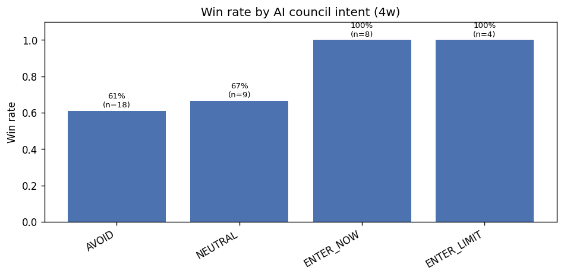

### 2.2 Deep Research verdict

| deep_research_verdict   |   count |   win_rate |   avg_return |   median_return | std_return   |
|:------------------------|--------:|-----------:|-------------:|----------------:|:-------------|
|                         |      29 |       0.69 |        0.344 |           0.066 | 0.806        |
| BUY_LIMIT               |       6 |       1    |        0.335 |           0.173 | 0.421        |
| AVOID                   |       3 |       1    |        0.152 |           0.148 | 0.066        |
| BUY                     |       1 |       0    |       -0.065 |          -0.065 |              |

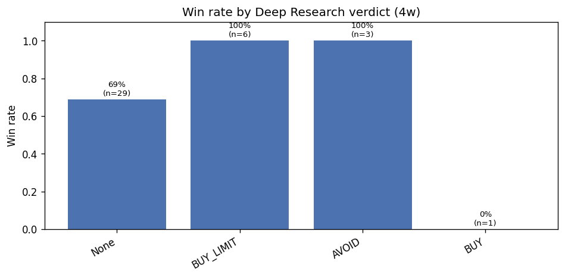

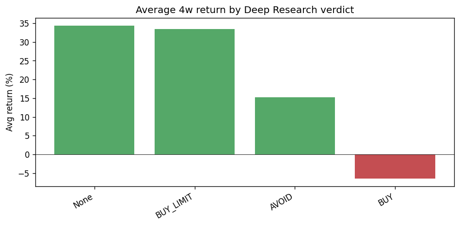

## 3. Statistical significance

**None of the 3 pairwise PM-intent comparisons** reach FDR-adjusted p<0.05. Sample sizes are small (n=18, 18, 8 per group), so the apparent gaps in win rate are not yet distinguishable from noise.

### 3.1 Pairwise tests on AI council intent

| A         | B         |   n_A |   n_B | Δ mean   |   Cohen d |   Welch p |   Welch p (FDR) |   MWU p |   MWU p (FDR) | Sig?   |
|:----------|:----------|------:|------:|:---------|----------:|----------:|----------------:|--------:|--------------:|:-------|
| AVOID     | ENTER_NOW |    18 |     8 | +5.37%   |      0.09 |     0.771 |           0.771 |   0.177 |         0.266 | —      |
| AVOID     | NEUTRAL   |    18 |     9 | -19.14%  |     -0.23 |     0.635 |           0.771 |   0.571 |         0.571 | —      |
| ENTER_NOW | NEUTRAL   |     8 |     9 | -24.51%  |     -0.31 |     0.512 |           0.771 |   0.092 |         0.266 | —      |

### 3.2 Pairwise tests on Deep Research verdict

DR verdicts: **none of the 1 pairwise comparisons** are significant — DR groups have n=3–6 each, far below what's needed to detect even large effects.

| A     | B         |   n_A |   n_B | Δ mean   |   Cohen d |   Welch p |   Welch p (FDR) |   MWU p |   MWU p (FDR) | Sig?   |
|:------|:----------|------:|------:|:---------|----------:|----------:|----------------:|--------:|--------------:|:-------|
| AVOID | BUY_LIMIT |     3 |     6 | -18.23%  |     -0.51 |     0.344 |           0.344 |   0.905 |         0.905 | —      |

**Interpretation.** Welch's t-test compares group means under the (relaxed) assumption that variances may differ. Mann-Whitney U is rank-based and works even when returns are skewed. Both p-values are FDR-adjusted (Benjamini-Hochberg) to control the false-discovery rate across the family of comparisons.

## 4. R/R ratio vs realized return

### 4.1 AI council R/R

| bucket   |   count | win_rate   | avg_return   | median_return   | std_return   |
|:---------|--------:|:-----------|:-------------|:----------------|:-------------|
| <1       |      23 | 0.609      | 0.075        | 0.021           | 0.149        |
| 1-2      |       6 | 0.833      | 0.098        | 0.122           | 0.085        |
| 2-3      |       6 | 1.000      | 0.853        | 0.364           | 1.176        |
| >=3      |       0 |            |              |                 |              |

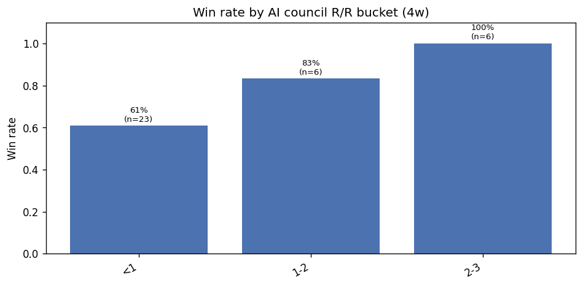

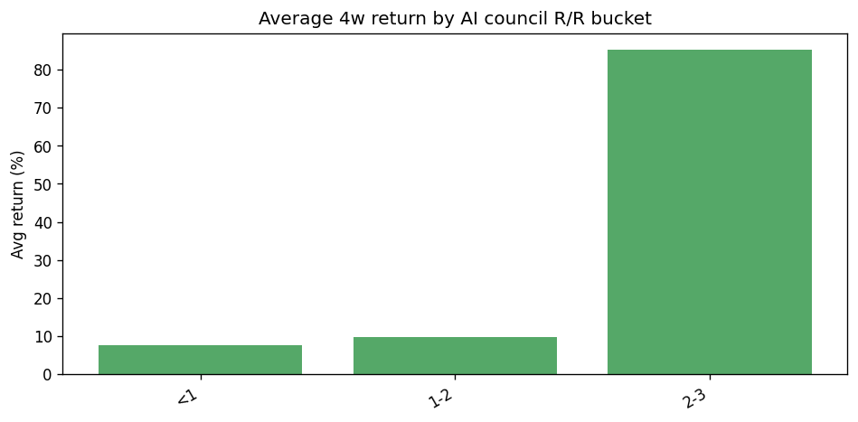

PM R/R vs 4w return (n=35): Pearson r=+0.377 (p=0.026), Spearman ρ=+0.090 (p=0.607). Pearson is significant but Spearman is not, meaning the linear correlation is being driven by a few high-R/R outliers rather than a monotonic relationship.

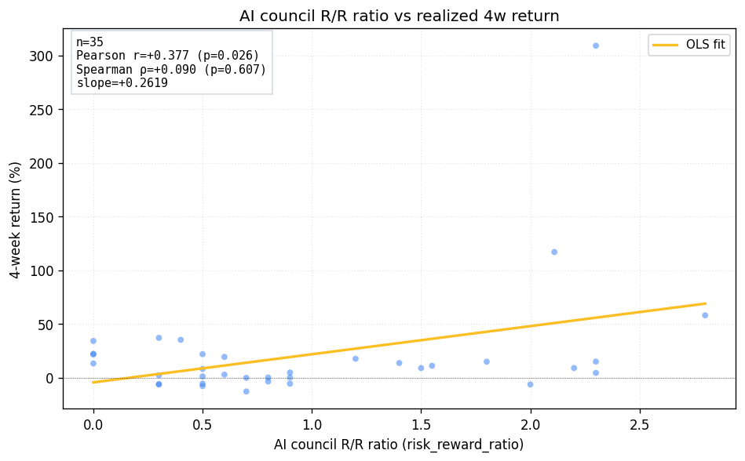

### 4.2 Deep Research R/R

| bucket   |   count | win_rate   | avg_return   | median_return   | std_return   |
|:---------|--------:|:-----------|:-------------|:----------------|:-------------|
| <1       |       4 | 1.000      | 0.227        | 0.218           | 0.086        |
| 2-3      |       3 | 1.000      | 0.453        | 0.148           | 0.622        |
| 1-2      |       2 | 0.500      | 0.022        | 0.022           | 0.123        |
| >=3      |       0 |            |              |                 |              |

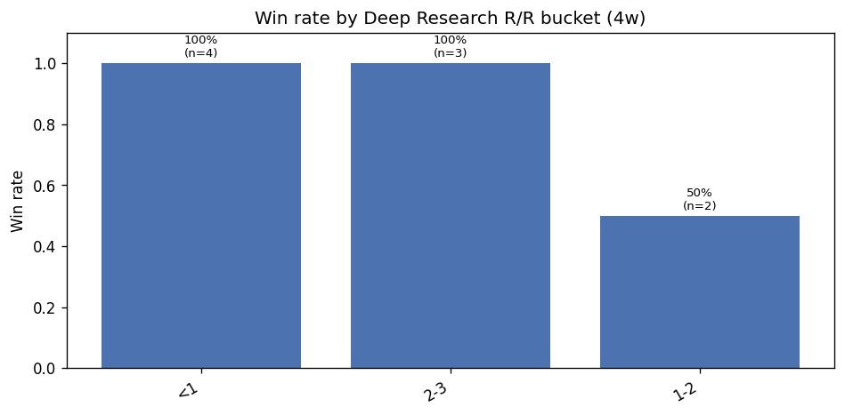

DR R/R vs 4w return (n=9): Pearson r=+0.097 (p=0.803), Spearman ρ=-0.332 (p=0.382). Sample size is small — conclusions are tentative.

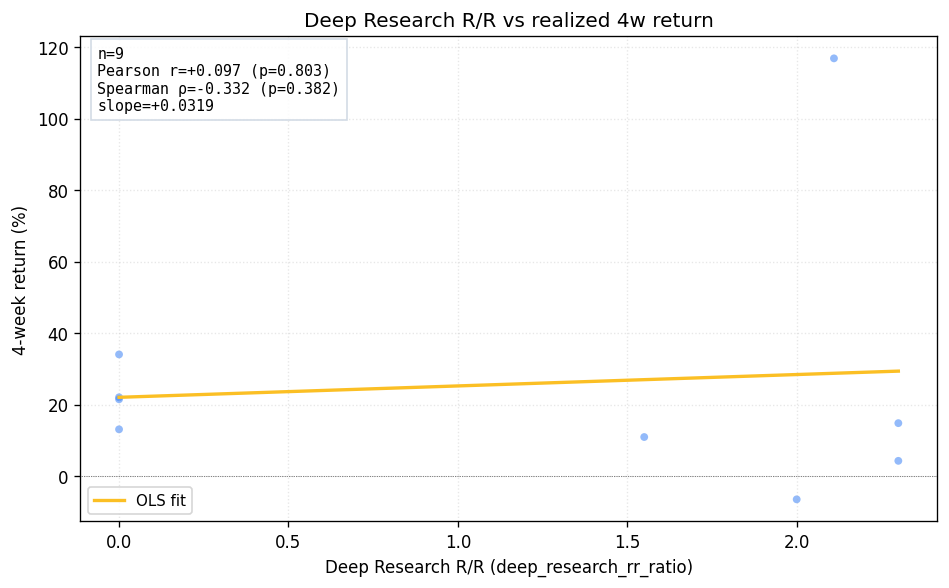

**Interpretation.** Pearson r captures linear association — if a few high-R/R, high-return rows dominate, Pearson can be inflated even when most of the data is uncorrelated. Spearman ρ ranks the values and is robust to those outliers; if the two coefficients disagree sharply the relationship is not monotonic and shouldn't be treated as predictive.

## 5. Recovery patterns

- **AVOID** (n=192): 48% recovered, median 2 days; +20d post-recovery: +33.18%
- **NEUTRAL** (n=75): 55% recovered, median 4 days; +20d post-recovery: +4.66%
- **ENTER_NOW** (n=53): 43% recovered, median 1 days; +20d post-recovery: +16.59%
- **ENTER_LIMIT** (n=52): 33% recovered, median 1 days; +20d post-recovery: +15.83%

### 5.1 By AI council intent

| group       |   n_total |   n_recov | recov%   |   p25 d |   p50 d |   p75 d |   p90 d | post +5d   | post +10d   | post +20d   |
|:------------|----------:|----------:|:---------|--------:|--------:|--------:|--------:|:-----------|:------------|:------------|
| AVOID       |       192 |        93 | 48%      |       0 |       2 |     4   |     8   | +1.04%     | -0.57%      | +33.18%     |
| NEUTRAL     |        75 |        41 | 55%      |       1 |       4 |     8   |    10   | -0.58%     | +0.25%      | +4.66%      |
| ENTER_NOW   |        53 |        23 | 43%      |       0 |       1 |     4.5 |     7.8 | +3.31%     | +2.02%      | +16.59%     |
| ENTER_LIMIT |        52 |        17 | 33%      |       0 |       1 |     5   |    10.8 | +2.25%     | +2.08%      | +15.83%     |

### 5.2 By Deep Research verdict

| group     |   n_total |   n_recov | recov%   |   p25 d |   p50 d |   p75 d |   p90 d | post +5d   | post +10d   | post +20d   |
|:----------|----------:|----------:|:---------|--------:|--------:|--------:|--------:|:-----------|:------------|:------------|
| nan       |       303 |       146 | 48%      |       0 |       2 |       6 |     9.5 | +0.55%     | -0.30%      | +26.12%     |
| BUY_LIMIT |        32 |        13 | 41%      |       0 |       4 |       5 |    10.4 | +5.13%     | +1.90%      | +15.58%     |
| AVOID     |        27 |         9 | 33%      |       0 |       0 |       4 |     7.2 | +5.56%     | +4.42%      | +15.45%     |
| BUY       |         9 |         5 | 56%      |       0 |       2 |       3 |     6   | +2.38%     | +2.97%      |             |
| WATCH     |         1 |         1 | 100%     |       0 |       0 |       0 |     0   | -0.41%     |             |             |

**Interpretation.** `days_to_recover` is the number of trading days from the decision date until the price first reaches the pre-drop level. The post-recovery columns measure what the stock did over the next 5/10/20 trading days *after* recovery — a positive number means the stock kept going up after reaching its pre-drop level.

## 6. Performance over time vs S&P 500

Median return path from the decision date forward, with SPY's median over the same calendar windows (dashed line) as a passive benchmark.

### 6.1 By AI council intent

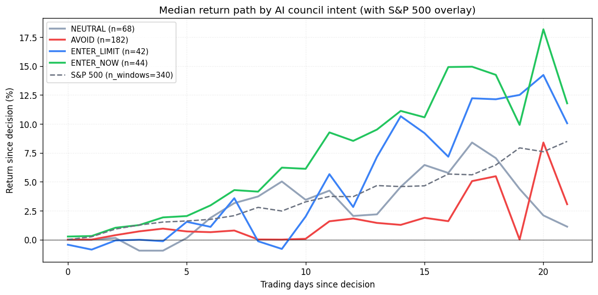

### 6.2 By Deep Research verdict

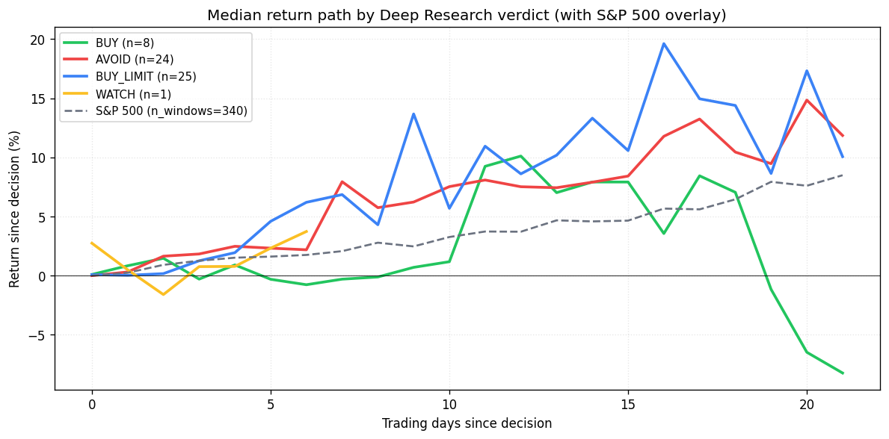

### 6.3 Excess return vs SPY (alpha)

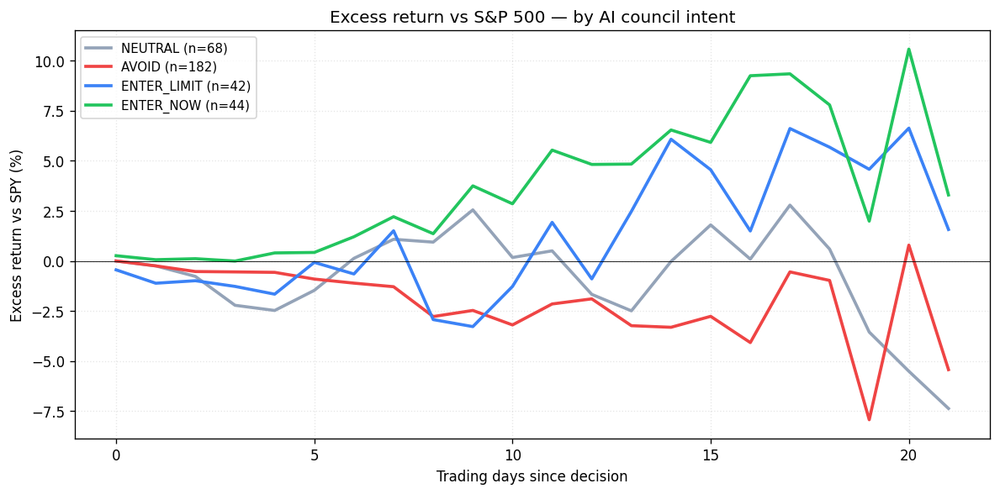

### 6.4 Per-decision BUY trajectories

Light grey lines are individual ENTER_NOW + ENTER_LIMIT decisions; bold lines are the per-intent medians. Useful for sense-checking how typical the median trajectory really is.

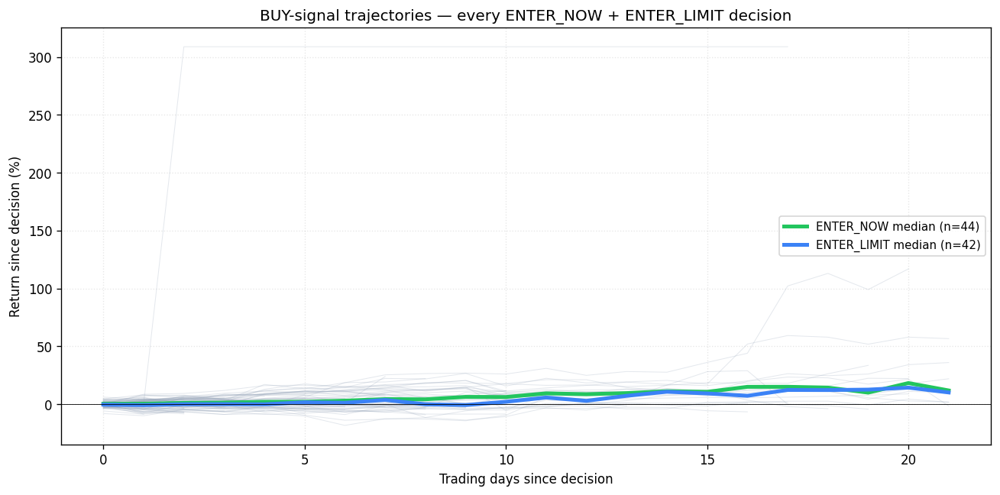

## 7. Drop-size buckets

## 8. Limitations

- **Forward-window coverage.** With current `decision_date` range, no decision   has more than ~22 trading days of forward data, which means the 4-week and   8-week return columns are NaN for most rows. Re-running this script after   more time elapses extends every horizon naturally.
- **Sample size.** After dropping rows without 4w returns, intent groups have   n=4–18 and DR-verdict groups have n=1–6. The pairwise significance tests are   honest about this — they refuse to call differences "real" until the data   catches up.
- **Market regime.** Cohort window appears to coincide with a broad SPY rally   (+7.6% median over 20 trading days). Many AVOIDs would have been profitable   passive holdings; that is a property of this regime and should not be   generalized.
- **Storage duplication.** `deep_research_action` and `deep_research_verdict`   carry identical values in this DB; the Q2/3.1 sections are therefore   redundant against the underlying signal.

## 9. Recommendations

- **Wait, then re-run.** The single largest analytical lift is more time.   Once the earliest decisions reach their 8-week mark, re-run   `build_package.py` and the same charts will tell a much sharper story.
- **Investigate AVOID hits.** AVOIDs with high `+20d` post-recovery returns   are worth pulling individually — was the AVOID a calibration bug, or did   the model correctly price in higher risk that didn't materialize this regime?
- **Drop the duplicate column.** Either consolidate `deep_research_verdict`   and `deep_research_action`, or document why both exist.
- **Backfill `ai_score`.** Currently populated for 10/363 rows, all = 50.   Either fully populate or remove from prompts; right now it can't inform   any analysis.

## Appendix

All raw data underlying this report is in `data/`:

- `cohort_enriched.csv` — every decision with computed return columns
- `winrate_by_*.csv` — per-group aggregations
- `stats_*.csv|.json` — significance and correlation results
- `time_series.json` — per-day median paths
- `time_series_individuals.json` — every BUY-signal trajectory
- `spy_bars.csv` — SPY OHLC for the cohort window
- `full_payload.json` — the entire JSON payload that drives   `deep-dive.html`

Interactive HTML report: [`deep-dive.html`](deep-dive.html)
