# StockDrop Performance Analysis — 2026-02-01 cohort

_Generated 2026-05-10 12:35. Cohort: **359 decisions**._

## Executive summary

Cohort of **359 decisions** with `decision_date >= 2026-02-01`, evaluated against yfinance OHLC bars cached locally. Headline 4-week metrics on BUY/BUY_LIMIT signals: win rate **100.0%**, avg return **+27.06%** (n=12).

**Headlines**

- BUY/BUY_LIMIT 4w win rate: **100.0%** (avg +27.06%, n=12)
- BUY_LIMIT fill rate: **56.0%** (28/50 filled), avg 4w on filled: **+15.17%**
- Median days to recover (recovered cohort): **2.0 days** (n=174)

SPY median over the same calendar windows: day-5 +1.61%, day-10 +3.26%, day-20 +7.60%.

Excess vs SPY at day-20 (group median minus SPY median): **ENTER_NOW** +10.58% (n=43), **ENTER_LIMIT** +6.63% (n=42), **AVOID** +0.37% (n=180), **NEUTRAL** -6.05% (n=67).

## 1. Equity curve

Equal-weight cumulative growth assuming each ENTER_NOW/ENTER_LIMIT decision is held for 4 weeks at its 4w return.

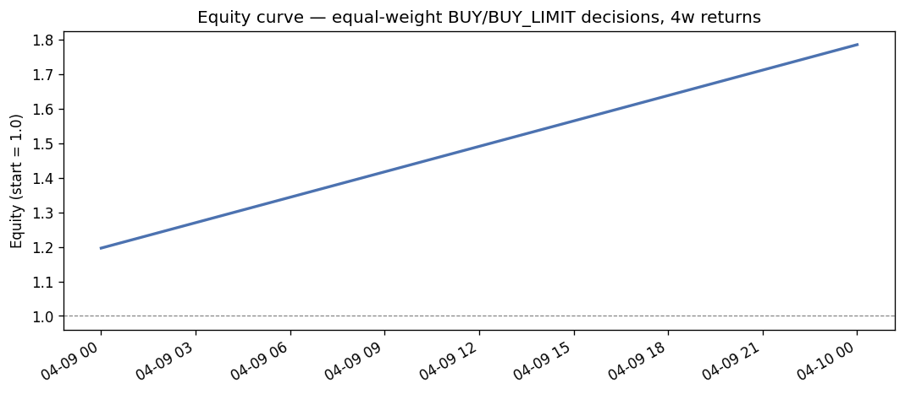

## 2. Verdict performance

### 2.1 AI council (PM) intent

| intent      |   count |   win_rate |   win_rate_se |   win_rate_ci_low |   win_rate_ci_high |   avg_return |   avg_return_se |   avg_return_ci_low |   avg_return_ci_high |   median_return |   std_return |
|:------------|--------:|-----------:|--------------:|------------------:|-------------------:|-------------:|----------------:|--------------------:|---------------------:|----------------:|-------------:|
| AVOID       |      17 |      0.588 |      0.119365 |          0.360054 |           0.783889 |        0.109 |       0.0471709 |          0.00894561 |             0.208941 |           0.08  |        0.194 |
| ENTER_NOW   |       8 |      1     |      0        |          0.675592 |           1        |        0.221 |       0.0605294 |          0.0776654  |             0.363924 |           0.182 |        0.171 |
| NEUTRAL     |       8 |      0.625 |      0.171163 |          0.305742 |           0.863156 |        0.138 |       0.148552  |         -0.213284   |             0.489257 |           0.015 |        0.42  |
| ENTER_LIMIT |       4 |      1     |      0        |          0.510109 |           1        |        0.37  |       0.267987  |         -0.482719   |             1.22299  |           0.142 |        0.536 |

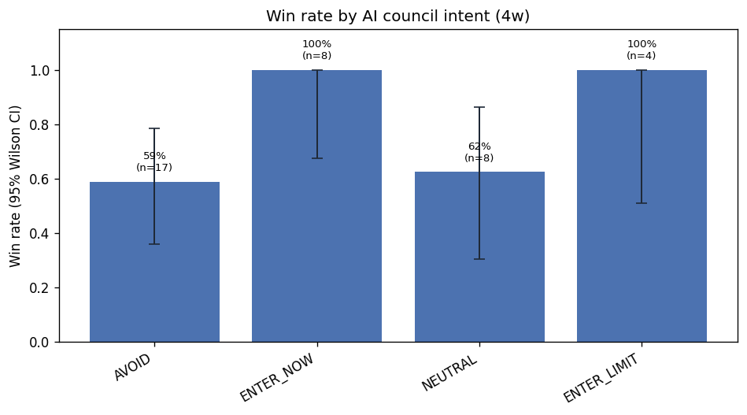

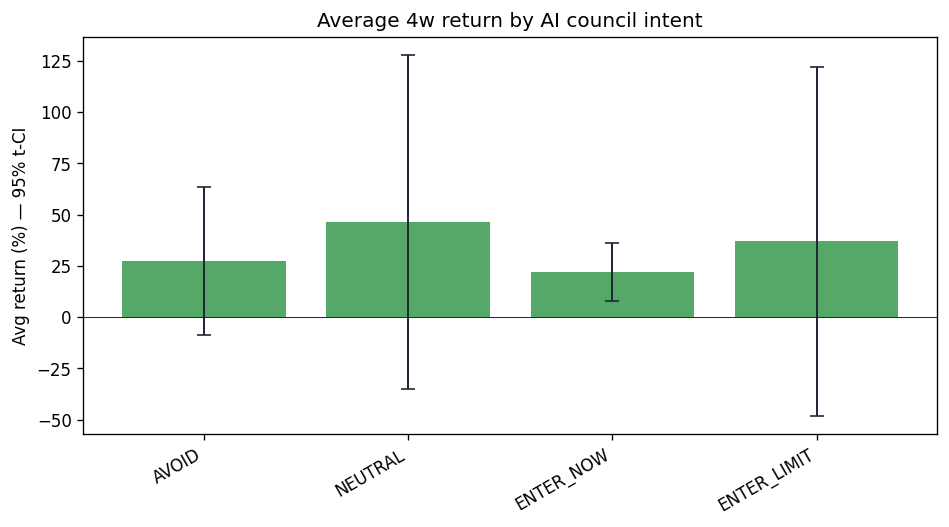

### 2.2 Deep Research verdict

| deep_research_verdict   |   count |   win_rate |   win_rate_se |   win_rate_ci_low |   win_rate_ci_high |   avg_return |   avg_return_se |   avg_return_ci_low |   avg_return_ci_high |   median_return | std_return   |
|:------------------------|--------:|-----------:|--------------:|------------------:|-------------------:|-------------:|----------------:|--------------------:|---------------------:|----------------:|:-------------|
|                         |      27 |      0.667 |     0.0907218 |          0.478248 |           0.813567 |        0.141 |       0.0536716 |           0.0304798 |             0.251127 |           0.047 | 0.279        |
| BUY_LIMIT               |       6 |      1     |     0         |          0.609666 |           1        |        0.335 |       0.171998  |          -0.107388  |             0.776884 |           0.173 | 0.421        |
| AVOID                   |       3 |      1     |     0         |          0.438503 |           1        |        0.152 |       0.0383088 |          -0.012357  |             0.317302 |           0.148 | 0.066        |
| BUY                     |       1 |      0     |     0         |          0        |           0.793451 |       -0.065 |     nan         |         nan         |           nan        |          -0.065 |              |

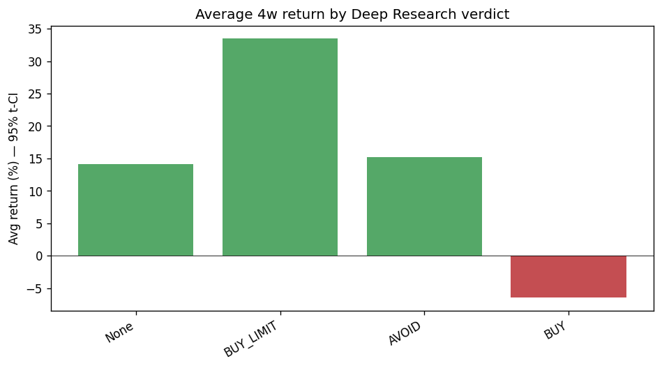

## 3. Statistical significance

**None of the 3 pairwise PM-intent comparisons** reach FDR-adjusted p<0.05. Sample sizes are small (n=17, 17, 8 per group), so the apparent gaps in win rate are not yet distinguishable from noise.

### 3.1 Pairwise tests on AI council intent

| A         | B         |   n_A |   n_B | Δ mean   |   Cohen d |   Welch p |   Welch p (FDR) |   MWU p |   MWU p (FDR) | Sig?   |
|:----------|:----------|------:|------:|:---------|----------:|----------:|----------------:|--------:|--------------:|:-------|
| AVOID     | ENTER_NOW |    17 |     8 | -11.19%  |     -0.6  |     0.165 |           0.495 |   0.097 |         0.146 | —      |
| AVOID     | NEUTRAL   |    17 |     8 | -2.90%   |     -0.1  |     0.857 |           0.857 |   0.366 |         0.366 | —      |
| ENTER_NOW | NEUTRAL   |     8 |     8 | +8.28%   |      0.26 |     0.618 |           0.857 |   0.024 |         0.072 | —      |

### 3.2 Pairwise tests on Deep Research verdict

DR verdicts: **none of the 1 pairwise comparisons** are significant — DR groups have n=3–6 each, far below what's needed to detect even large effects.

| A     | B         |   n_A |   n_B | Δ mean   |   Cohen d |   Welch p |   Welch p (FDR) |   MWU p |   MWU p (FDR) | Sig?   |
|:------|:----------|------:|------:|:---------|----------:|----------:|----------------:|--------:|--------------:|:-------|
| AVOID | BUY_LIMIT |     3 |     6 | -18.23%  |     -0.51 |     0.344 |           0.344 |   0.905 |         0.905 | —      |

**Interpretation.** Welch's t-test compares group means under the (relaxed) assumption that variances may differ. Mann-Whitney U is rank-based and works even when returns are skewed. Both p-values are FDR-adjusted (Benjamini-Hochberg) to control the false-discovery rate across the family of comparisons.

### 3.3 Pairwise tests at 1-week and 2-week horizons

**Pairwise PM intent at 1w (n_per_group is much larger):**

| A           | B           |   n_A |   n_B | Δ mean   |   Cohen d |   Welch p |   Welch p (FDR) |   MWU p |   MWU p (FDR) | Sig?   |
|:------------|:------------|------:|------:|:---------|----------:|----------:|----------------:|--------:|--------------:|:-------|
| AVOID       | ENTER_LIMIT |   154 |    27 | -0.00%   |     -0    |     0.999 |           0.999 |   0.903 |         0.903 | —      |
| AVOID       | ENTER_NOW   |   154 |    32 | -1.46%   |     -0.16 |     0.291 |           0.836 |   0.369 |         0.903 | —      |
| AVOID       | NEUTRAL     |   154 |    55 | +0.58%   |      0.06 |     0.669 |           0.893 |   0.613 |         0.903 | —      |
| ENTER_LIMIT | ENTER_NOW   |    27 |    32 | -1.46%   |     -0.22 |     0.418 |           0.836 |   0.489 |         0.903 | —      |
| ENTER_LIMIT | NEUTRAL     |    27 |    55 | +0.58%   |      0.07 |     0.745 |           0.893 |   0.809 |         0.903 | —      |
| ENTER_NOW   | NEUTRAL     |    32 |    55 | +2.04%   |      0.27 |     0.199 |           0.836 |   0.251 |         0.903 | —      |

**Pairwise PM intent at 2w:**

| A           | B           |   n_A |   n_B | Δ mean   |   Cohen d |   Welch p |   Welch p (FDR) |   MWU p |   MWU p (FDR) | Sig?   |
|:------------|:------------|------:|------:|:---------|----------:|----------:|----------------:|--------:|--------------:|:-------|
| AVOID       | ENTER_LIMIT |   113 |    16 | -2.62%   |     -0.24 |     0.373 |           0.702 |   0.604 |         0.612 | —      |
| AVOID       | ENTER_NOW   |   113 |    16 | -4.33%   |     -0.41 |     0.027 |           0.163 |   0.066 |         0.28  | —      |
| AVOID       | NEUTRAL     |   113 |    35 | -3.09%   |     -0.29 |     0.108 |           0.323 |   0.093 |         0.28  | —      |
| ENTER_LIMIT | ENTER_NOW   |    16 |    16 | -1.71%   |     -0.2  |     0.585 |           0.702 |   0.418 |         0.612 | —      |
| ENTER_LIMIT | NEUTRAL     |    16 |    35 | -0.47%   |     -0.05 |     0.88  |           0.88  |   0.612 |         0.612 | —      |
| ENTER_NOW   | NEUTRAL     |    16 |    35 | +1.24%   |      0.15 |     0.58  |           0.702 |   0.577 |         0.612 | —      |

**Pairwise DR verdict at 1w:**

| A     | B         |   n_A |   n_B | Δ mean   |   Cohen d |   Welch p |   Welch p (FDR) |   MWU p |   MWU p (FDR) | Sig?   |
|:------|:----------|------:|------:|:---------|----------:|----------:|----------------:|--------:|--------------:|:-------|
| AVOID | BUY       |    15 |     6 | +1.00%   |      0.17 |     0.696 |           0.696 |   0.733 |         0.733 | —      |
| AVOID | BUY_LIMIT |    15 |    18 | -1.82%   |     -0.28 |     0.43  |           0.645 |   0.504 |         0.733 | —      |
| BUY   | BUY_LIMIT |     6 |    18 | -2.83%   |     -0.44 |     0.279 |           0.645 |   0.415 |         0.733 | —      |

**Pairwise DR verdict at 2w:**

| A     | B         |   n_A |   n_B | Δ mean   |   Cohen d |   Welch p |   Welch p (FDR) |   MWU p |   MWU p (FDR) | Sig?   |
|:------|:----------|------:|------:|:---------|----------:|----------:|----------------:|--------:|--------------:|:-------|
| AVOID | BUY       |     7 |     4 | +0.82%   |      0.13 |     0.867 |           0.937 |   0.788 |             1 | —      |
| AVOID | BUY_LIMIT |     7 |    10 | -0.28%   |     -0.04 |     0.937 |           0.937 |   1     |             1 | —      |
| BUY   | BUY_LIMIT |     4 |    10 | -1.10%   |     -0.12 |     0.839 |           0.937 |   0.839 |             1 | —      |

## 4. R/R ratio vs realized return

### 4.1 AI council R/R

| bucket   |   count | win_rate   |   win_rate_se |   win_rate_ci_low |   win_rate_ci_high | avg_return   |   avg_return_se |   avg_return_ci_low |   avg_return_ci_high | median_return   | std_return   |
|:---------|--------:|:-----------|--------------:|------------------:|-------------------:|:-------------|----------------:|--------------------:|---------------------:|:----------------|:-------------|
| <1       |      23 | 0.609      |      0.101764 |          0.407855 |           0.778424 | 0.075        |       0.0311253 |          0.0107923  |             0.139892 | 0.021           | 0.149        |
| 1-2      |       6 | 0.833      |      0.152145 |          0.436497 |           0.969947 | 0.098        |       0.0348772 |          0.00879879 |             0.188108 | 0.122           | 0.085        |
| 2-3      |       5 | 1.000      |      0        |          0.565518 |           1        | 0.405        |       0.213448  |         -0.187151   |             0.998104 | 0.148           | 0.477        |
| >=3      |       0 |            |    nan        |        nan        |         nan        |              |     nan         |        nan          |           nan        |                 |              |

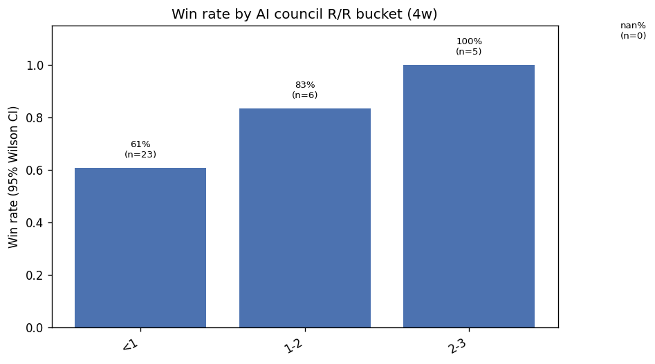

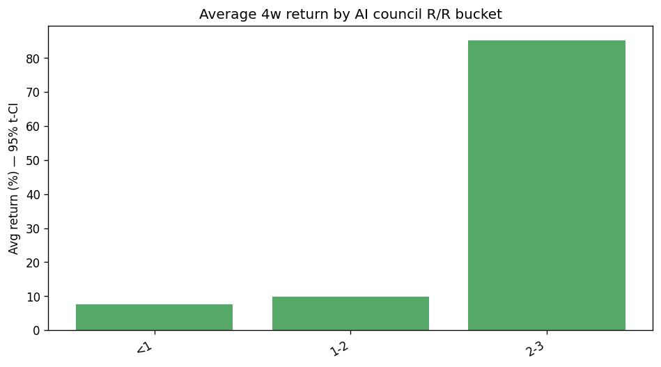

PM R/R vs 4w return (n=34): Pearson r=+0.286 (p=0.101) 95% CI [-0.06, +0.57], Spearman ρ=+0.012 (p=0.945) 95% CI [-0.33, +0.35]. Neither correlation reaches p<0.05.

**Correlation at multiple horizons:**

| horizon   |   n |   Pearson r |   Pearson p | Pearson 95% CI   |   Spearman ρ |   Spearman p | Spearman 95% CI   |
|:----------|----:|------------:|------------:|:-----------------|-------------:|-------------:|:------------------|
| 1w        | 243 |      -0.005 |       0.944 | [-0.130, +0.121] |        0.035 |        0.592 | [-0.092, +0.160]  |
| 2w        | 161 |       0.077 |       0.331 | [-0.079, +0.229] |        0.104 |        0.188 | [-0.052, +0.255]  |
| 4w        |  34 |       0.286 |       0.101 | [-0.058, +0.569] |        0.012 |        0.945 | [-0.327, +0.349]  |

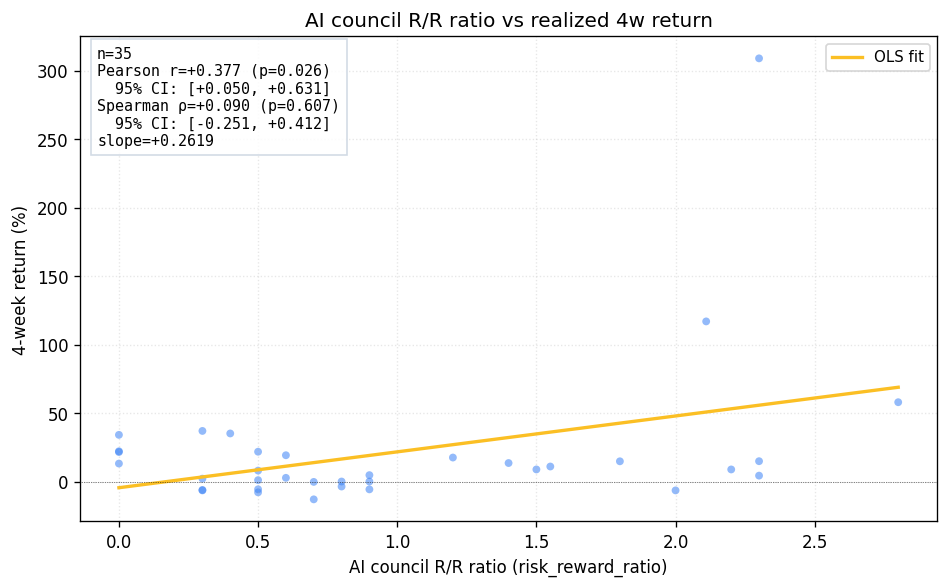

### 4.2 Deep Research R/R

| bucket   |   count | win_rate   |   win_rate_se |   win_rate_ci_low |   win_rate_ci_high | avg_return   |   avg_return_se |   avg_return_ci_low |   avg_return_ci_high | median_return   | std_return   |
|:---------|--------:|:-----------|--------------:|------------------:|-------------------:|:-------------|----------------:|--------------------:|---------------------:|:----------------|:-------------|
| <1       |       4 | 1.000      |      0        |         0.510109  |           1        | 0.227        |       0.0431036 |           0.0897685 |             0.364119 | 0.218           | 0.086        |
| 2-3      |       3 | 1.000      |      0        |         0.438503  |           1        | 0.453        |       0.359045  |          -1.09141   |             1.99828  | 0.148           | 0.622        |
| 1-2      |       2 | 0.500      |      0.353553 |         0.0945312 |           0.905469 | 0.022        |       0.0871786 |          -1.0853    |             1.13011  | 0.022           | 0.123        |
| >=3      |       0 |            |    nan        |       nan         |         nan        |              |     nan         |         nan         |           nan        |                 |              |

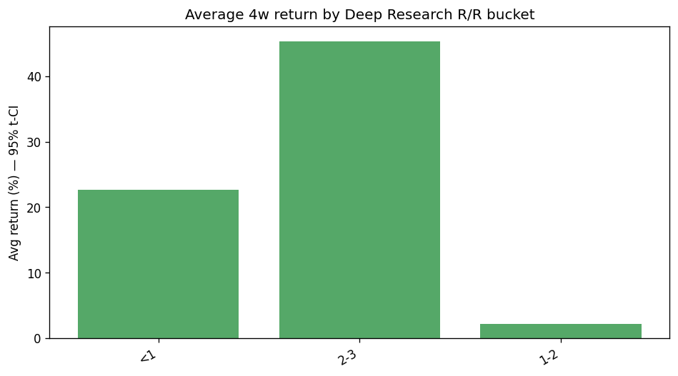

DR R/R vs 4w return (n=9): Pearson r=+0.097 (p=0.803), Spearman ρ=-0.332 (p=0.382). Sample size is small — conclusions are tentative.

**Correlation at multiple horizons:**

| horizon   |   n |   Pearson r |   Pearson p | Pearson 95% CI   |   Spearman ρ |   Spearman p | Spearman 95% CI   |
|:----------|----:|------------:|------------:|:-----------------|-------------:|-------------:|:------------------|
| 1w        |  37 |      -0.199 |       0.237 | [-0.492, +0.133] |       -0.153 |        0.367 | [-0.456, +0.182]  |
| 2w        |  18 |      -0.344 |       0.162 | [-0.699, +0.146] |       -0.467 |        0.051 | [-0.778, +0.026]  |
| 4w        |   9 |       0.097 |       0.803 | [-0.606, +0.715] |       -0.332 |        0.382 |                   |

**Interpretation.** Pearson r captures linear association — if a few high-R/R, high-return rows dominate, Pearson can be inflated even when most of the data is uncorrelated. Spearman ρ ranks the values and is robust to those outliers; if the two coefficients disagree sharply the relationship is not monotonic and shouldn't be treated as predictive.

## 5. Recovery patterns

- **AVOID** (n=188): 49% recovered, median 2 days; +20d post-recovery: +33.18%
- **NEUTRAL** (n=72): 57% recovered, median 4 days; +20d post-recovery: +4.66%
- **ENTER_LIMIT** (n=50): 34% recovered, median 1 days; +20d post-recovery: +15.83%
- **ENTER_NOW** (n=49): 47% recovered, median 1 days; +20d post-recovery: +16.59%

### 5.1 By AI council intent

| group       |   n_total |   n_recov | recov%   |   p25 d |   p50 d |   p75 d |   p90 d | post +5d   | post +10d   | post +20d   |
|:------------|----------:|----------:|:---------|--------:|--------:|--------:|--------:|:-----------|:------------|:------------|
| AVOID       |       188 |        93 | 49%      |       0 |       2 |     4   |     8   | +1.04%     | -0.57%      | +33.18%     |
| NEUTRAL     |        72 |        41 | 57%      |       1 |       4 |     8   |    10   | -0.58%     | +0.25%      | +4.66%      |
| ENTER_LIMIT |        50 |        17 | 34%      |       0 |       1 |     5   |    10.8 | +2.25%     | +2.08%      | +15.83%     |
| ENTER_NOW   |        49 |        23 | 47%      |       0 |       1 |     4.5 |     7.8 | +3.31%     | +2.02%      | +16.59%     |

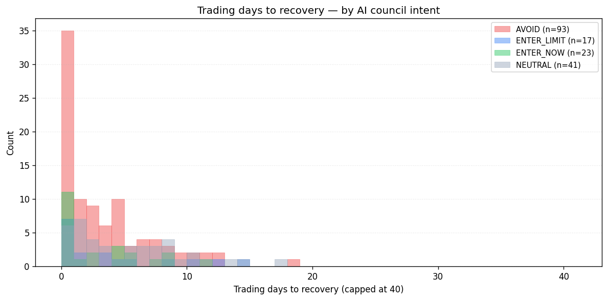

### 5.2 By Deep Research verdict

| group     |   n_total |   n_recov | recov%   |   p25 d |   p50 d |   p75 d |   p90 d | post +5d   | post +10d   | post +20d   |
|:----------|----------:|----------:|:---------|--------:|--------:|--------:|--------:|:-----------|:------------|:------------|
| nan       |       291 |       146 | 50%      |       0 |       2 |       6 |     9.5 | +0.55%     | -0.30%      | +26.12%     |
| BUY_LIMIT |        32 |        13 | 41%      |       0 |       4 |       5 |    10.4 | +5.13%     | +1.90%      | +15.58%     |
| AVOID     |        26 |         9 | 35%      |       0 |       0 |       4 |     7.2 | +5.56%     | +4.42%      | +15.45%     |
| BUY       |         9 |         5 | 56%      |       0 |       2 |       3 |     6   | +2.38%     | +2.97%      |             |
| WATCH     |         1 |         1 | 100%     |       0 |       0 |       0 |     0   | -0.41%     |             |             |

**Interpretation.** `days_to_recover` is the number of trading days from the decision date until the price first reaches the pre-drop level. The post-recovery columns measure what the stock did over the next 5/10/20 trading days *after* recovery — a positive number means the stock kept going up after reaching its pre-drop level.

## 6. Performance over time vs S&P 500

Median return path from the decision date forward, with SPY's median over the same calendar windows (dashed line) as a passive benchmark.

### 6.1 By AI council intent

Two views: median path with **inter-quartile range** band (default), and mean path with **95% t-CI** band.

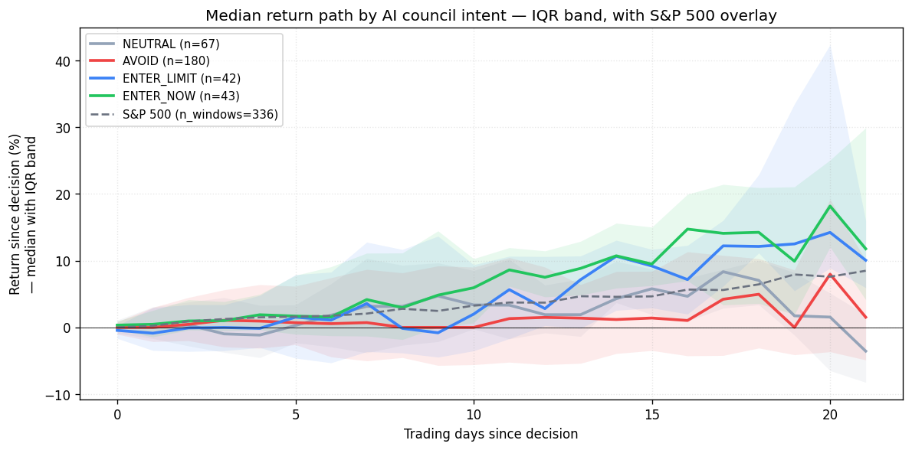

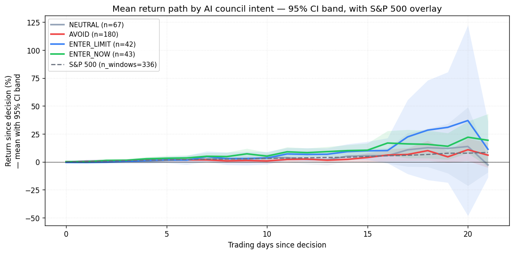

### 6.2 By Deep Research verdict

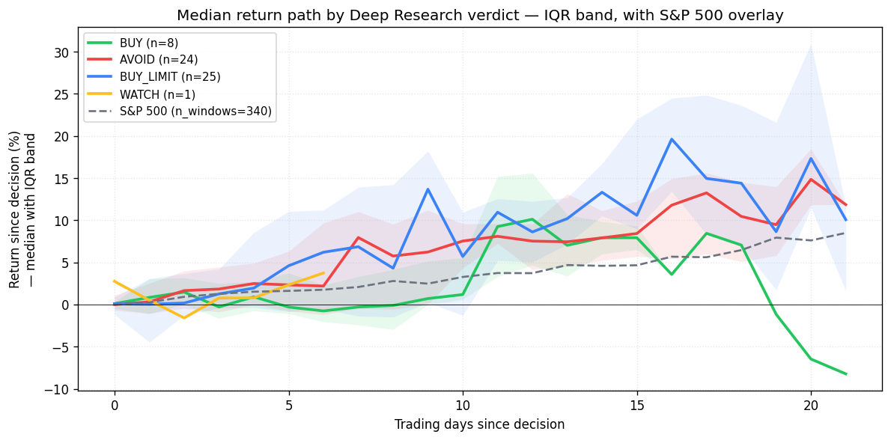

### 6.3 Excess return vs SPY (alpha)

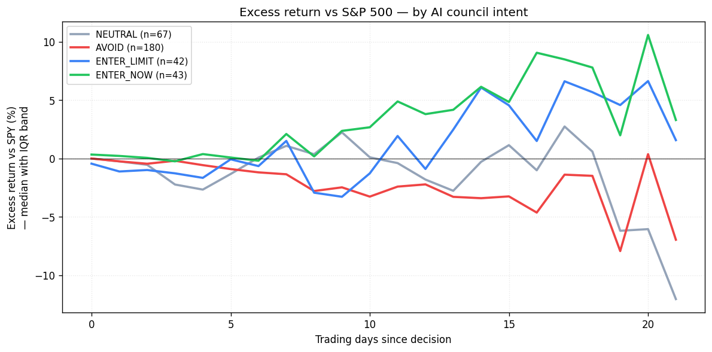

### 6.4 Per-decision BUY trajectories

Light grey lines are individual ENTER_NOW + ENTER_LIMIT decisions; bold lines are the per-intent medians. Useful for sense-checking how typical the median trajectory really is.

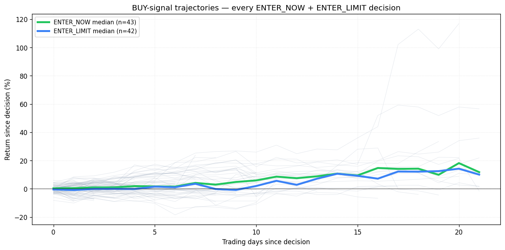

## 7. Drop-size buckets

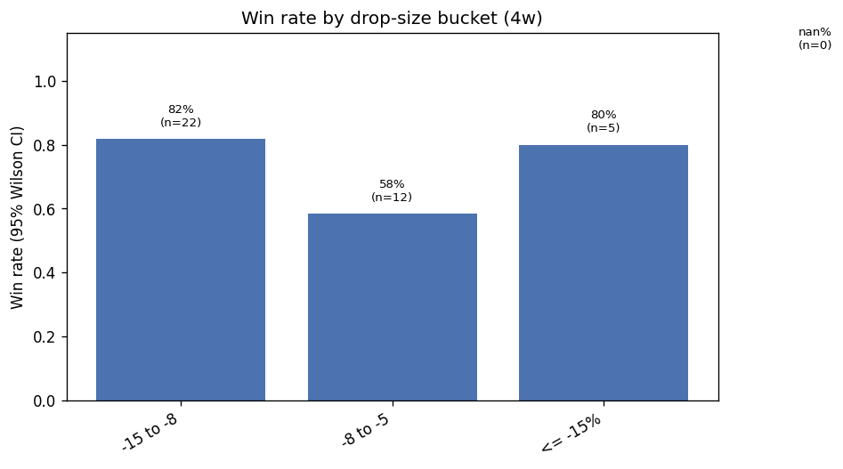

## 7a. Horizon comparison — 1w / 2w / 4w

The 4-week return is small-sample (n=39 with completed bars). 1-week and 2-week returns are much better powered (n=272 and n=184). All subsequent significance tests and bucket aggregations are now computed at every horizon; the bars below show win rate (top) and average return (bottom) side-by-side per intent. Wilson + t-CI error bars come along for the ride.

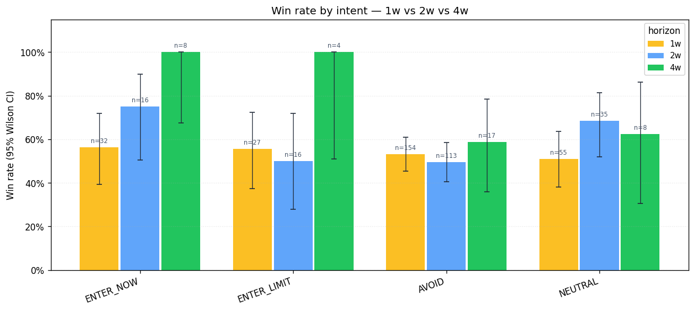

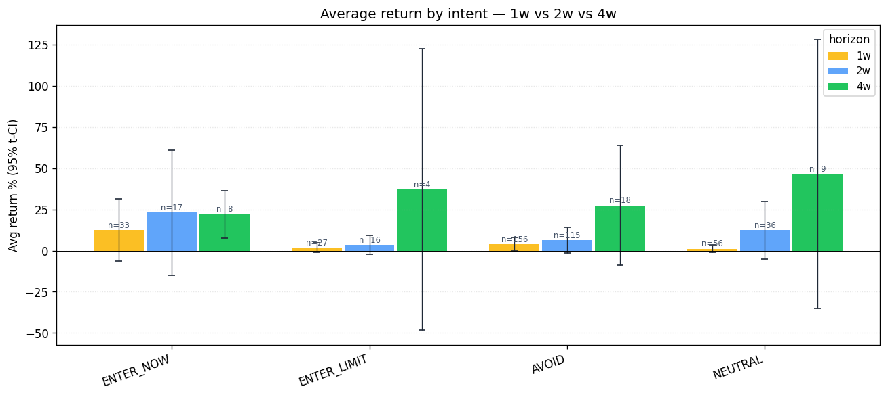

**Per-intent win rate and avg return at each horizon:**

| group       | horizon   |   n | win_rate   | WR 95% CI       | avg_return   | AR 95% CI           |
|:------------|:----------|----:|:-----------|:----------------|:-------------|:--------------------|
| AVOID       | 1w        | 154 | 53.2%      | [45.4%, 61.0%]  | +1.82%       | [+0.27%, +3.36%]    |
| AVOID       | 2w        | 113 | 49.6%      | [40.5%, 58.6%]  | +0.85%       | [-1.20%, +2.90%]    |
| AVOID       | 4w        |  17 | 58.8%      | [36.0%, 78.4%]  | +10.89%      | [+0.89%, +20.89%]   |
| ENTER_LIMIT | 1w        |  27 | 55.6%      | [37.3%, 72.4%]  | +1.82%       | [-1.03%, +4.67%]    |
| ENTER_LIMIT | 2w        |  16 | 50.0%      | [28.0%, 72.0%]  | +3.46%       | [-2.25%, +9.17%]    |
| ENTER_LIMIT | 4w        |   4 | 100.0%     | [51.0%, 100.0%] | +37.01%      | [-48.27%, +122.30%] |
| ENTER_NOW   | 1w        |  32 | 56.2%      | [39.3%, 71.8%]  | +3.28%       | [+0.98%, +5.58%]    |
| ENTER_NOW   | 2w        |  16 | 75.0%      | [50.5%, 89.8%]  | +5.18%       | [+1.87%, +8.49%]    |
| ENTER_NOW   | 4w        |   8 | 100.0%     | [67.6%, 100.0%] | +22.08%      | [+7.77%, +36.39%]   |
| NEUTRAL     | 1w        |  55 | 50.9%      | [38.1%, 63.6%]  | +1.24%       | [-0.95%, +3.43%]    |
| NEUTRAL     | 2w        |  35 | 68.6%      | [52.0%, 81.4%]  | +3.94%       | [+0.71%, +7.17%]    |
| NEUTRAL     | 4w        |   8 | 62.5%      | [30.6%, 86.3%]  | +13.80%      | [-21.33%, +48.93%]  |

**By drop-size bucket at each horizon:**

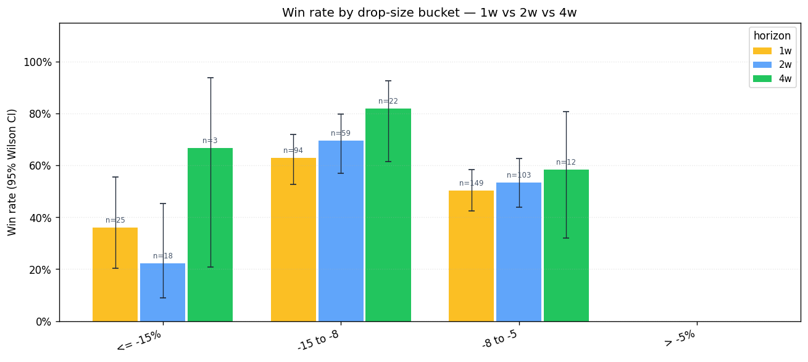

**By PM R/R bucket at each horizon:**

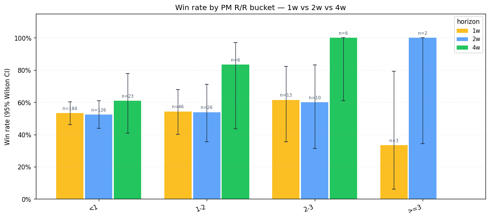

**By DR R/R bucket at each horizon:**

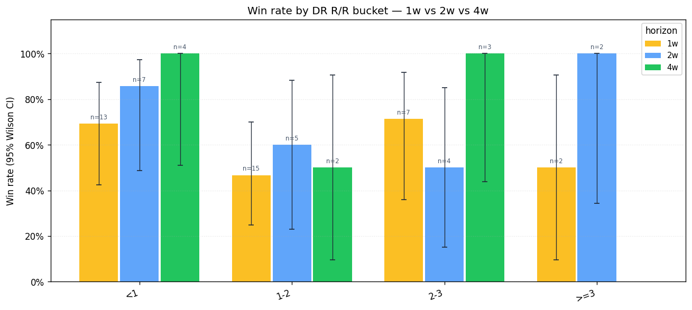

## 8a. R/R distribution by verdict (categorical correlation)

How does each council assign its R/R ratings to its own verdict groups? Below: per-group descriptives, one-way ANOVA (parametric), and Kruskal-Wallis (rank-based) for the omnibus test of "are the group distributions the same?" Plus pairwise Welch t-tests with FDR-adjusted p-values.

### 8a.1 PM R/R by AI council intent

| group       |   n |   mean |    SE |   CI low |   CI high |   median |   std |   min |   max |
|:------------|----:|-------:|------:|---------:|----------:|---------:|------:|------:|------:|
| AVOID       | 176 |  0.643 | 0.044 |    0.556 |     0.731 |     0.5  | 0.589 |   0   |   5.4 |
| NEUTRAL     |  51 |  0.886 | 0.084 |    0.718 |     1.054 |     0.7  | 0.598 |   0.1 |   2.8 |
| ENTER_LIMIT |  50 |  1.144 | 0.095 |    0.952 |     1.335 |     1    | 0.673 |   0   |   2.9 |
| ENTER_NOW   |  49 |  1.503 | 0.127 |    1.249 |     1.758 |     1.56 | 0.887 |   0   |   4   |

**Omnibus:** ANOVA: F=25.09, p=<0.001 · Kruskal-Wallis: H=65.20, p=<0.001.

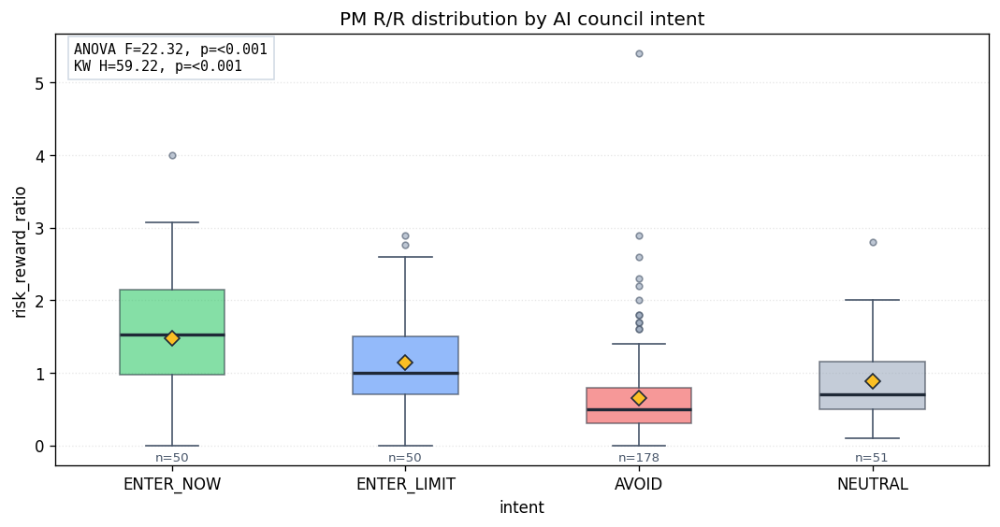

| A           | B           |   n_A |   n_B | Δ mean   |   Cohen d | Welch p   | Welch p (FDR)   | MWU p   | MWU p (FDR)   | Sig?   |
|:------------|:------------|------:|------:|:---------|----------:|:----------|:----------------|:--------|:--------------|:-------|
| AVOID       | ENTER_LIMIT |   176 |    50 | -50.04%  |     -0.82 | <0.001    | <0.001          | <0.001  | <0.001        | ✅     |
| AVOID       | ENTER_NOW   |   176 |    49 | -86.03%  |     -1.29 | <0.001    | <0.001          | <0.001  | <0.001        | ✅     |
| AVOID       | NEUTRAL     |   176 |    51 | -24.31%  |     -0.41 | 0.012     | 0.018           | 0.002   | 0.003         | ✅     |
| ENTER_LIMIT | ENTER_NOW   |    50 |    49 | -35.99%  |     -0.46 | 0.026     | 0.031           | 0.010   | 0.013         | ✅     |
| ENTER_LIMIT | NEUTRAL     |    50 |    51 | +25.73%  |      0.4  | 0.045     | 0.045           | 0.022   | 0.022         | ✅     |
| ENTER_NOW   | NEUTRAL     |    49 |    51 | +61.72%  |      0.82 | <0.001    | <0.001          | <0.001  | <0.001        | ✅     |

### 8a.2 DR R/R by Deep Research verdict

| group     |   n |   mean | SE    | CI low   | CI high   |   median | std   |   min |   max |
|:----------|----:|-------:|:------|:---------|:----------|---------:|:------|------:|------:|
| BUY_LIMIT |  32 |  1.634 | 0.131 | 1.366    | 1.902     |    1.675 | 0.743 |  0    |  3.07 |
| AVOID     |  23 |  1.231 | 0.184 | 0.849    | 1.614     |    1.03  | 0.884 |  0    |  2.9  |
| BUY       |   8 |  1.952 | 0.402 | 1.002    | 2.903     |    2     | 1.137 |  0    |  4    |
| WATCH     |   1 |  0.82  |       |          |           |    0.82  |       |  0.82 |  0.82 |

**Omnibus:** ANOVA: F=2.65, p=0.079 · Kruskal-Wallis: H=5.28, p=0.071.

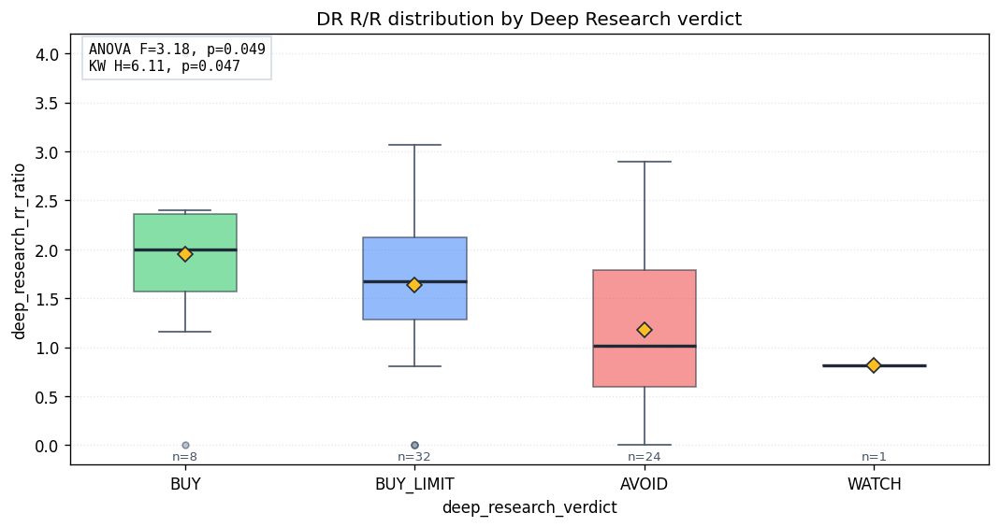

| A     | B         |   n_A |   n_B | Δ mean   |   Cohen d |   Welch p |   Welch p (FDR) |   MWU p |   MWU p (FDR) | Sig?   |
|:------|:----------|------:|------:|:---------|----------:|----------:|----------------:|--------:|--------------:|:-------|
| AVOID | BUY       |    23 |     8 | -72.12%  |     -0.76 |     0.134 |           0.201 |   0.07  |         0.105 | —      |
| AVOID | BUY_LIMIT |    23 |    32 | -40.28%  |     -0.5  |     0.082 |           0.201 |   0.061 |         0.105 | —      |
| BUY   | BUY_LIMIT |     8 |    32 | +31.84%  |      0.38 |     0.472 |           0.472 |   0.37  |         0.37  | —      |

**Interpretation.** ANOVA and Kruskal-Wallis answer the question "is *any* group different from the others?" If both omnibus tests fail to reach p<0.05 the council is not assigning systematically different R/R to different verdict groups (and the pairwise tests will reflect that).

## 8b. High-R/R decisions in the cohort

Top 25 rows by R/R ratio for each council, with their realized returns where available. Full lists exported as `data/top_pm_rr.csv` and `data/top_dr_rr.csv`.

### 8b.1 Top by PM R/R (`risk_reward_ratio`)

| symbol   | decision_date   | intent      | recommendation   |   risk_reward_ratio | drop_percent   | price_at_decision   | deep_research_verdict   | return_1w   | return_2w   | return_4w   | max_roi_4w   | max_drawdown_4w   |
|:---------|:----------------|:------------|:-----------------|--------------------:|:---------------|:--------------------|:------------------------|:------------|:------------|:------------|:-------------|:------------------|
| CHKP     | 2026-04-30      | AVOID       | AVOID            |                5.4  | -1694.06%      | $116.25             |                         | -0.59%      |             |             | +7.24%       | -3.46%            |
| LBRDP    | 2026-04-24      | ENTER_NOW   | BUY              |                4    | -597.17%       | $21.96              | BUY                     | -0.30%      | +0.89%      |             | +6.58%       | -4.17%            |
| NICE     | 2026-04-11      | ENTER_NOW   | BUY              |                3.07 | -714.15%       | $97.00              | BUY_LIMIT               | +8.79%      | +4.08%      |             | +30.41%      | -6.49%            |
| NOC      | 2026-04-21      | AVOID       | AVOID            |                2.9  | -580.15%       | $618.87             |                         | -6.63%      | -9.74%      |             | +5.52%       | -12.06%           |
| FDX      | 2026-05-04      | ENTER_LIMIT | BUY_LIMIT        |                2.9  | -674.68%       | $367.11             | AVOID                   |             |             |             | +4.41%       | -3.53%            |
| TEAM     | 2026-04-09      | ENTER_NOW   | BUY              |                2.8  | -804.78%       | $58.50              |                         | +17.49%     | +15.59%     | +57.90%     | +64.65%      | -4.26%            |
| TRUMF    | 2026-04-13      | NEUTRAL     | WATCH            |                2.8  | -528.93%       | $12.40              |                         | +1.77%      | +1.77%      |             | +8.47%       | -0.00%            |
| CRC      | 2026-05-06      | ENTER_LIMIT | BUY_LIMIT        |                2.76 | -960.36%       | $63.40              | AVOID                   |             |             |             | +8.76%       | -7.80%            |
| CE       | 2026-05-06      | ENTER_LIMIT | BUY_LIMIT        |                2.6  | -954.93%       | $62.42              | BUY_LIMIT               |             |             |             | +6.92%       | -10.29%           |
| FIS      | 2026-05-08      | ENTER_NOW   | BUY              |                2.6  | -584.13%       | $44.49              | BUY_LIMIT               |             |             |             |              |                   |
| MHK      | 2026-05-04      | AVOID       | AVOID            |                2.6  | -546.88%       | $94.47              |                         |             |             |             | +13.50%      | -0.92%            |
| ALC      | 2026-05-06      | ENTER_NOW   | BUY              |                2.4  | -967.09%       | $67.25              | BUY                     |             |             |             | +0.61%       | -7.21%            |
| HUBS     | 2026-05-08      | ENTER_LIMIT | BUY_LIMIT        |                2.4  | -2333.01%      | $186.86             | BUY_LIMIT               |             |             |             |              |                   |
| REGN     | 2026-04-29      | ENTER_NOW   | BUY              |                2.35 | -621.85%       | $686.26             | BUY                     | +5.07%      |             |             | +5.81%       | -2.54%            |
| IAG      | 2026-04-21      | ENTER_NOW   | BUY              |                2.33 | -718.53%       | $17.18              | BUY_LIMIT               | -4.02%      | -5.06%      |             | +13.10%      | -6.69%            |
| POOL     | 2026-05-05      | ENTER_LIMIT | BUY_LIMIT        |                2.3  | -606.21%       | $190.91             | AVOID                   |             |             |             | +3.88%       | -3.36%            |
| ADSK     | 2026-04-09      | ENTER_NOW   | BUY              |                2.3  | -916.27%       | $218.60             | AVOID                   | +11.24%     | +6.12%      | +14.84%     | +16.72%      | -2.06%            |
| NOW      | 2026-04-09      | ENTER_NOW   | BUY              |                2.3  | -793.58%       | $89.73              | BUY_LIMIT               | +7.47%      | -5.52%      | +4.30%      | +16.45%      | -9.47%            |
| WTW      | 2026-04-30      | ENTER_NOW   | BUY              |                2.24 | -1417.39%      | $248.99             | BUY_LIMIT               | +3.65%      |             |             | +7.47%       | -0.96%            |
| CEBCF    | 2026-04-10      | AVOID       | AVOID            |                2.2  | -1436.36%      | $0.38               |                         | +8.81%      | +16.77%     | +8.81%      | +16.77%      | +0.00%            |
| CHYM     | 2026-05-07      | ENTER_NOW   | BUY              |                2.2  | -704.10%       | $20.20              |                         |             |             |             | +6.19%       | -9.90%            |
| PPERF    | 2026-04-11      | ENTER_NOW   | BUY              |                2.2  | -2316.78%      | $0.26               | AVOID                   | -0.00%      | -0.00%      |             | -0.00%       | -0.00%            |
| ZBH      | 2026-04-28      | ENTER_NOW   | BUY              |                2.16 | -706.34%       | $86.05              | BUY_LIMIT               | -3.53%      |             |             | +3.01%       | -7.23%            |
| DOCN     | 2026-04-10      | ENTER_LIMIT | BUY_LIMIT        |                2.11 | -1328.44%      | $75.59              | BUY_LIMIT               | +13.28%     | +25.96%     | +116.89%    | +117.98%     | -4.52%            |
| TOST     | 2026-05-08      | ENTER_NOW   | BUY              |                2.11 | -1463.58%      | $25.08              | BUY_LIMIT               |             |             |             |              |                   |

### 8b.2 Top by DR R/R (`deep_research_rr_ratio`)

| symbol   | decision_date   | intent      | recommendation   |   deep_research_rr_ratio | drop_percent   | price_at_decision   | deep_research_verdict   | return_1w   | return_2w   | return_4w   | max_roi_4w   | max_drawdown_4w   |
|:---------|:----------------|:------------|:-----------------|-------------------------:|:---------------|:--------------------|:------------------------|:------------|:------------|:------------|:-------------|:------------------|
| LBRDP    | 2026-04-24      | ENTER_NOW   | BUY              |                     4    | -597.17%       | $21.96              | BUY                     | -0.30%      | +0.89%      |             | +6.58%       | -4.17%            |
| NICE     | 2026-04-11      | ENTER_NOW   | BUY              |                     3.07 | -714.15%       | $97.00              | BUY_LIMIT               | +8.79%      | +4.08%      |             | +30.41%      | -6.49%            |
| FDX      | 2026-05-04      | ENTER_LIMIT | BUY_LIMIT        |                     2.9  | -674.68%       | $367.11             | AVOID                   |             |             |             | +4.41%       | -3.53%            |
| CRC      | 2026-05-06      | ENTER_LIMIT | BUY_LIMIT        |                     2.76 | -960.36%       | $63.40              | AVOID                   |             |             |             | +8.76%       | -7.80%            |
| FIS      | 2026-05-08      | ENTER_NOW   | BUY              |                     2.6  | -584.13%       | $44.49              | BUY_LIMIT               |             |             |             |              |                   |
| CE       | 2026-05-06      | ENTER_LIMIT | BUY_LIMIT        |                     2.6  | -954.93%       | $62.42              | BUY_LIMIT               |             |             |             | +6.92%       | -10.29%           |
| HUBS     | 2026-05-08      | ENTER_LIMIT | BUY_LIMIT        |                     2.4  | -2333.01%      | $186.86             | BUY_LIMIT               |             |             |             |              |                   |
| ALC      | 2026-05-06      | ENTER_NOW   | BUY              |                     2.4  | -967.09%       | $67.25              | BUY                     |             |             |             | +0.61%       | -7.21%            |
| REGN     | 2026-04-29      | ENTER_NOW   | BUY              |                     2.35 | -621.85%       | $686.26             | BUY                     | +5.07%      |             |             | +5.81%       | -2.54%            |
| IAG      | 2026-04-21      | ENTER_NOW   | BUY              |                     2.33 | -718.53%       | $17.18              | BUY_LIMIT               | -4.02%      | -5.06%      |             | +13.10%      | -6.69%            |
| NOW      | 2026-04-09      | ENTER_NOW   | BUY              |                     2.3  | -793.58%       | $89.73              | BUY_LIMIT               | +7.47%      | -5.52%      | +4.30%      | +16.45%      | -9.47%            |
| POOL     | 2026-05-05      | ENTER_LIMIT | BUY_LIMIT        |                     2.3  | -606.21%       | $190.91             | AVOID                   |             |             |             | +3.88%       | -3.36%            |
| ADSK     | 2026-04-09      | ENTER_NOW   | BUY              |                     2.3  | -916.27%       | $218.60             | AVOID                   | +11.24%     | +6.12%      | +14.84%     | +16.72%      | -2.06%            |
| WTW      | 2026-04-30      | ENTER_NOW   | BUY              |                     2.24 | -1417.39%      | $248.99             | BUY_LIMIT               | +3.65%      |             |             | +7.47%       | -0.96%            |
| ZBH      | 2026-04-28      | ENTER_NOW   | BUY              |                     2.16 | -706.34%       | $86.05              | BUY_LIMIT               | -3.53%      |             |             | +3.01%       | -7.23%            |
| TOST     | 2026-05-08      | ENTER_NOW   | BUY              |                     2.11 | -1463.58%      | $25.08              | BUY_LIMIT               |             |             |             |              |                   |
| DOCN     | 2026-04-10      | ENTER_LIMIT | BUY_LIMIT        |                     2.11 | -1328.44%      | $75.59              | BUY_LIMIT               | +13.28%     | +25.96%     | +116.89%    | +117.98%     | -4.52%            |
| SYM      | 2026-05-08      | ENTER_NOW   | BUY              |                     2.03 | -845.30%       | $51.66              | BUY_LIMIT               |             |             |             |              |                   |
| ALLE     | 2026-04-28      | ENTER_NOW   | BUY              |                     2    | -745.96%       | $137.33             | BUY_LIMIT               | -3.67%      |             |             | +2.93%       | -4.45%            |
| APA      | 2026-04-09      | NEUTRAL     | PENDING          |                     2    | -979.98%       | $38.75              | BUY                     | -2.19%      | -0.23%      | -6.48%      | +8.62%       | -13.73%           |
| NMR      | 2026-04-24      | ENTER_NOW   | BUY              |                     2    | -526.00%       | $7.83               | BUY                     | -0.32%      | +1.47%      |             | +4.79%       | -1.47%            |
| DPZ      | 2026-04-27      | ENTER_NOW   | BUY              |                     1.96 | -934.67%       | $333.45             | BUY_LIMIT               | -0.91%      |             |             | +3.53%       | -3.65%            |
| EMBJ     | 2026-05-08      | ENTER_LIMIT | BUY_LIMIT        |                     1.9  | -791.14%       | $62.39              | AVOID                   |             |             |             |              |                   |
| CLX      | 2026-05-01      | ENTER_LIMIT | BUY_LIMIT        |                     1.86 | -895.38%       | $87.81              | AVOID                   | +4.96%      |             |             | +6.44%       | -3.54%            |
| EXPE     | 2026-05-08      | ENTER_NOW   | BUY              |                     1.8  | -869.50%       | $230.81             | BUY_LIMIT               |             |             |             |              |                   |

## 9. Profit and loss decomposition

Two complementary views of how each group's wins and losses played out *over time*.

### 8.1 Winner vs loser trajectories per category

Each cohort row is classified at day-20 by the sign of its return. The panels below show the **mean winning trajectory** vs the **mean losing trajectory** within each category, with 95% CI bands.

Why this matters: a high overall avg return can come from many small wins or a few large ones; this chart lets you see the asymmetry.

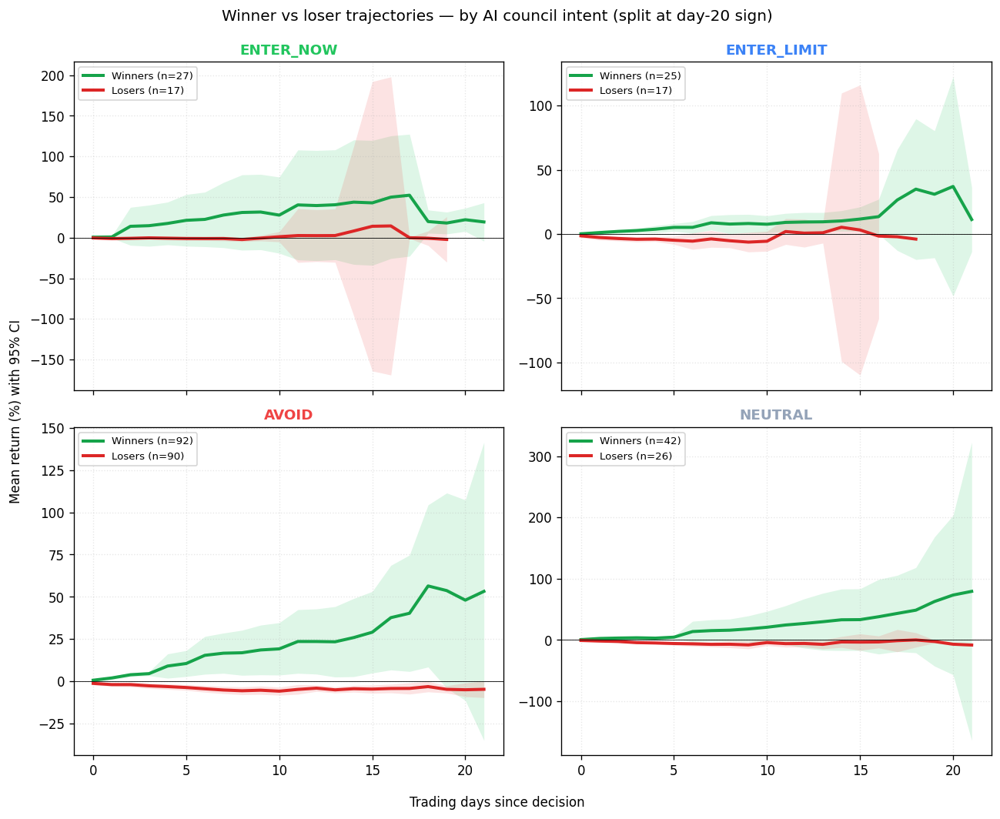

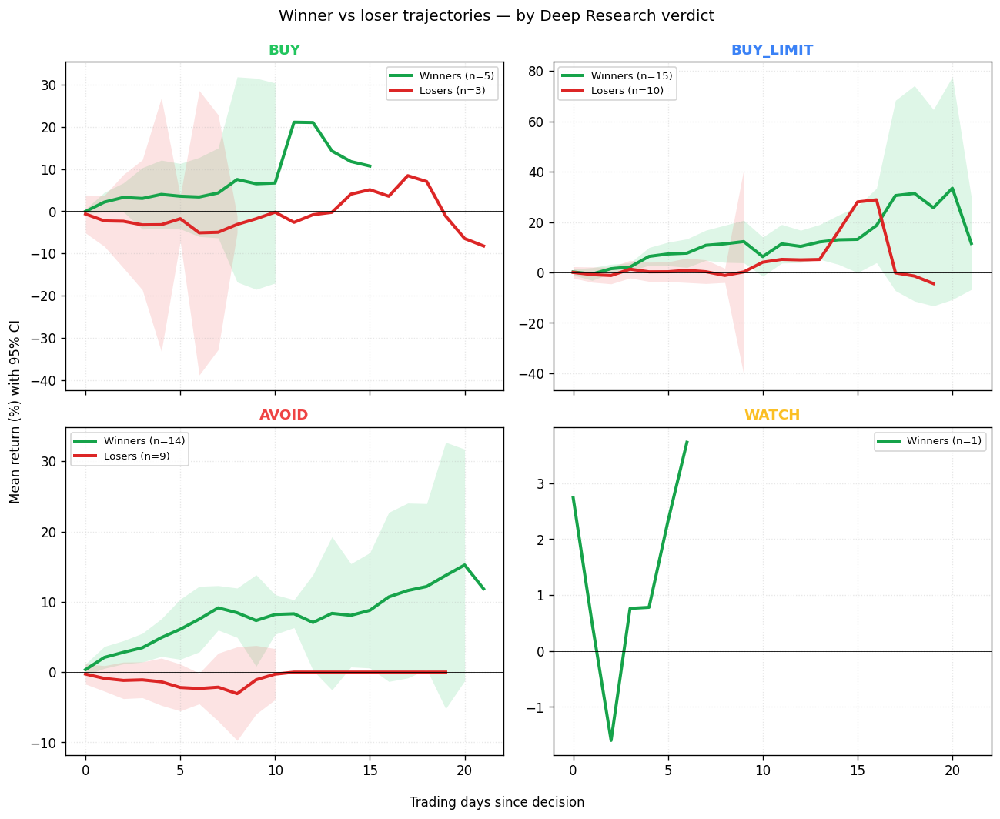

### 8.2 Cumulative mark-to-market P&L over calendar time

Assume **\$1 is invested at every signal** at the decision-date close, held forward, and marked to its closing price every subsequent trading day. The lines below sum that mark-to-market P&L across every open position, by category, on each calendar date.

Useful for seeing *when* the P&L accrued (early jump? steady drift?) and how each category's book performed in real time.

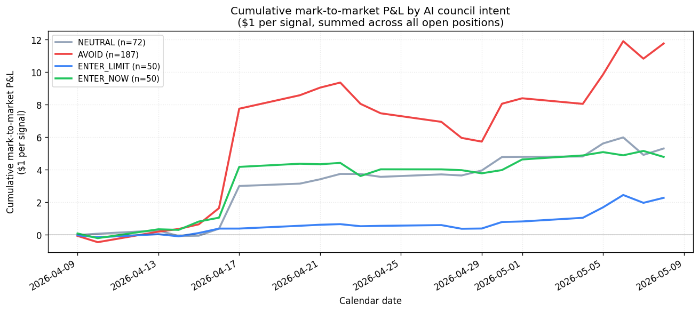

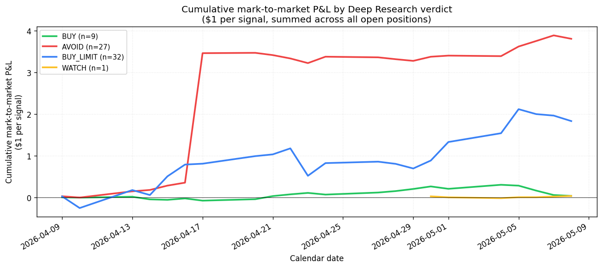

## 10. Limitations

- **Forward-window coverage.** With current `decision_date` range, no decision   has more than ~22 trading days of forward data, which means the 4-week and   8-week return columns are NaN for most rows. Re-running this script after   more time elapses extends every horizon naturally.
- **Sample size.** After dropping rows without 4w returns, intent groups have   n=4–18 and DR-verdict groups have n=1–6. The pairwise significance tests are   honest about this — they refuse to call differences "real" until the data   catches up.
- **Market regime.** Cohort window appears to coincide with a broad SPY rally   (+7.6% median over 20 trading days). Many AVOIDs would have been profitable   passive holdings; that is a property of this regime and should not be   generalized.
- **Storage duplication.** `deep_research_action` and `deep_research_verdict`   carry identical values in this DB; the Q2/3.1 sections are therefore   redundant against the underlying signal.

## 11. Recommendations

- **Wait, then re-run.** The single largest analytical lift is more time.   Once the earliest decisions reach their 8-week mark, re-run   `build_package.py` and the same charts will tell a much sharper story.
- **Investigate AVOID hits.** AVOIDs with high `+20d` post-recovery returns   are worth pulling individually — was the AVOID a calibration bug, or did   the model correctly price in higher risk that didn't materialize this regime?
- **Drop the duplicate column.** Either consolidate `deep_research_verdict`   and `deep_research_action`, or document why both exist.
- **Backfill `ai_score`.** Currently populated for 10/363 rows, all = 50.   Either fully populate or remove from prompts; right now it can't inform   any analysis.

## Appendix

All raw data underlying this report is in `data/`:

- `cohort_enriched.csv` — every decision with computed return columns
- `winrate_by_*.csv` — per-group aggregations
- `stats_*.csv|.json` — significance and correlation results
- `time_series.json` — per-day median paths
- `time_series_individuals.json` — every BUY-signal trajectory
- `spy_bars.csv` — SPY OHLC for the cohort window
- `full_payload.json` — the entire JSON payload that drives   `deep-dive.html`

Interactive HTML report: [`deep-dive.html`](deep-dive.html)
