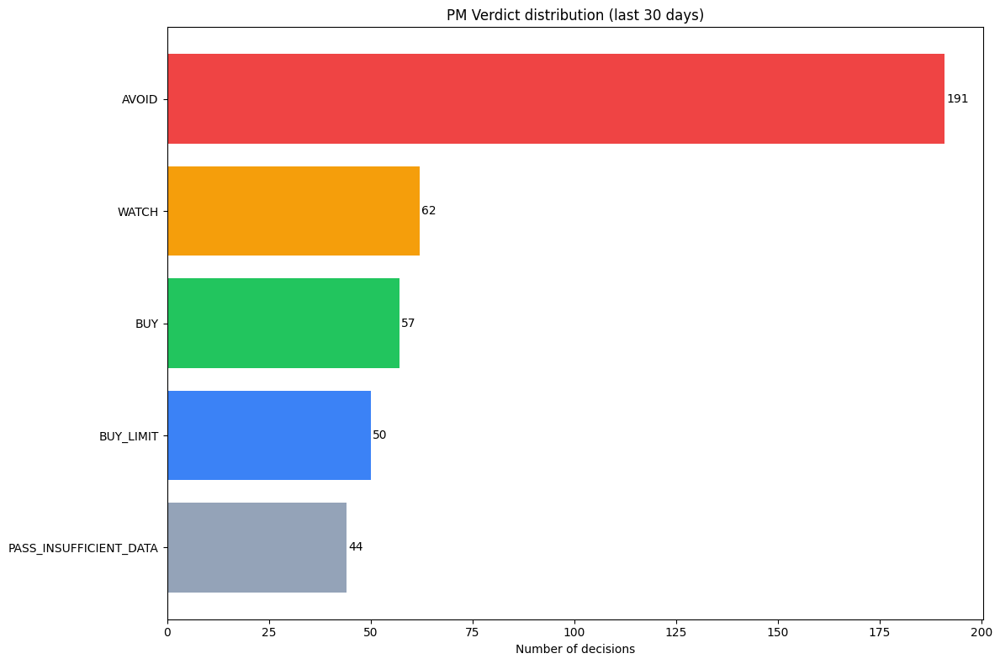
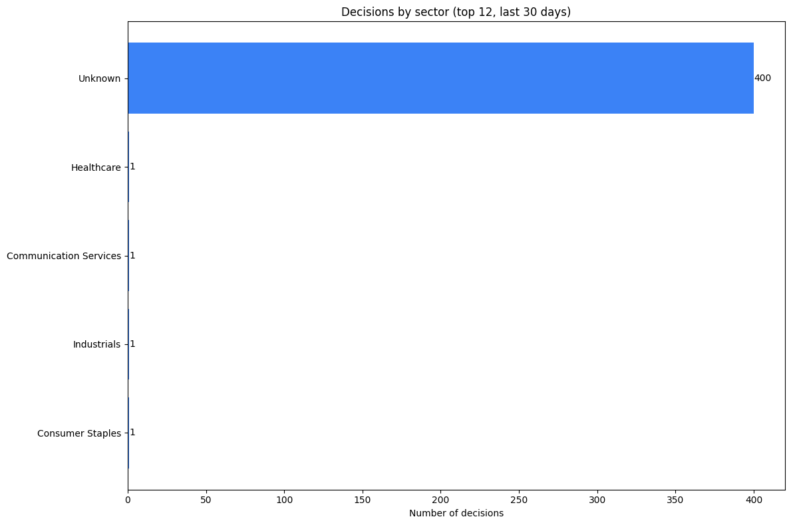
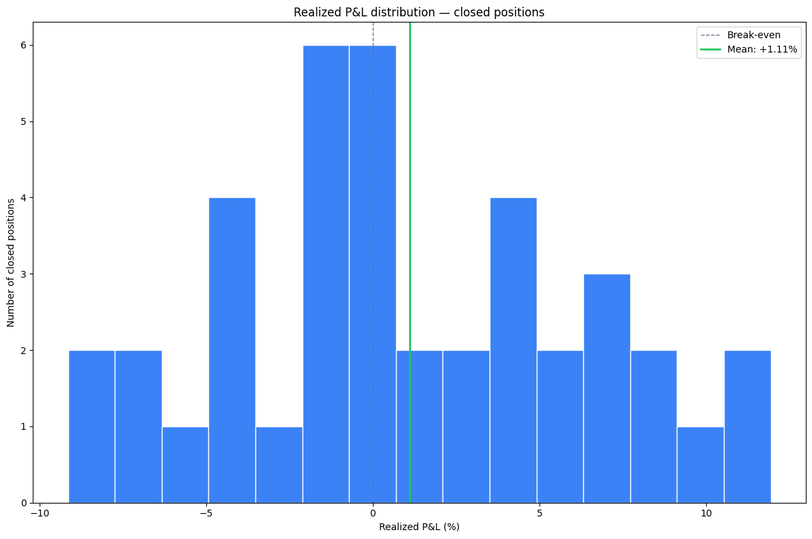
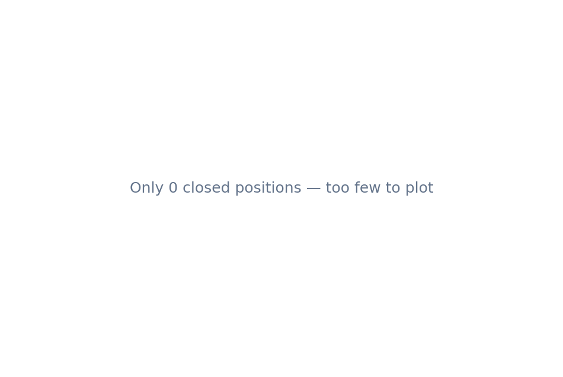

# StockDrop — Monthly Snapshot (2026-04-24 → 2026-05-24)

> Generated 2026-05-24 from the project SQLite database. Browse the data, charts, and case studies below.

This snapshot captures **404 decisions** the AI council made over the trailing 30 days, plus the realized/unrealized outcomes of every position the desk took during that window.

The free-text reasoning from the LLM agents is **deliberately excluded** — this snapshot is about the numbers, not the model's prose.

---

## At a glance

| Metric | Value |
|---|---|
| Decisions | 404 (BUY: 57, BUY_LIMIT: 50, WATCH: 62, AVOID: 191) |
| Positions taken | 45 (40 closed, 5 open) |
| Win rate (closed) | 55.0% |
| Mean realized P&L | +1.11% |

## Charts

### Verdict distribution


### Sector breakdown


### Realized P&L distribution


### AI score vs. realized outcome


## Case studies

- [Best trade]( case-studies/01-best-trade.md )
- [Worst trade]( case-studies/02-worst-trade.md )
- [Correctly avoided]( case-studies/03-avoided-correctly.md )
- [Still open]( case-studies/04-still-open.md )

## Raw data

- [decisions.csv](data/decisions.csv) — the ~25 structured columns per decision
- [positions.csv](data/positions.csv) — every position taken, with entry/exit and P&L
- [monthly_summary.csv](data/monthly_summary.csv) — pre-aggregated counts and win rate by verdict
- [schema.sql](data/schema.sql) — `CREATE TABLE` for the shipped tables
- [Data dictionary](data/README.md) — column-by-column explanation

## How this snapshot was built

```bash
python scripts/build_monthly_snapshot.py --as-of 2026-05-24
```

The script reads the project SQLite database in read-only mode (`?mode=ro`), filters to the last 30 days, drops every free-text LLM column, renders the charts, fills this template, and writes everything to `docs/performance/2026-05-24-package/`.

[Spec](../../superpowers/specs/2026-05-24-monthly-snapshot-design.md) · [Plan](../../superpowers/plans/2026-05-24-monthly-snapshot.md)
